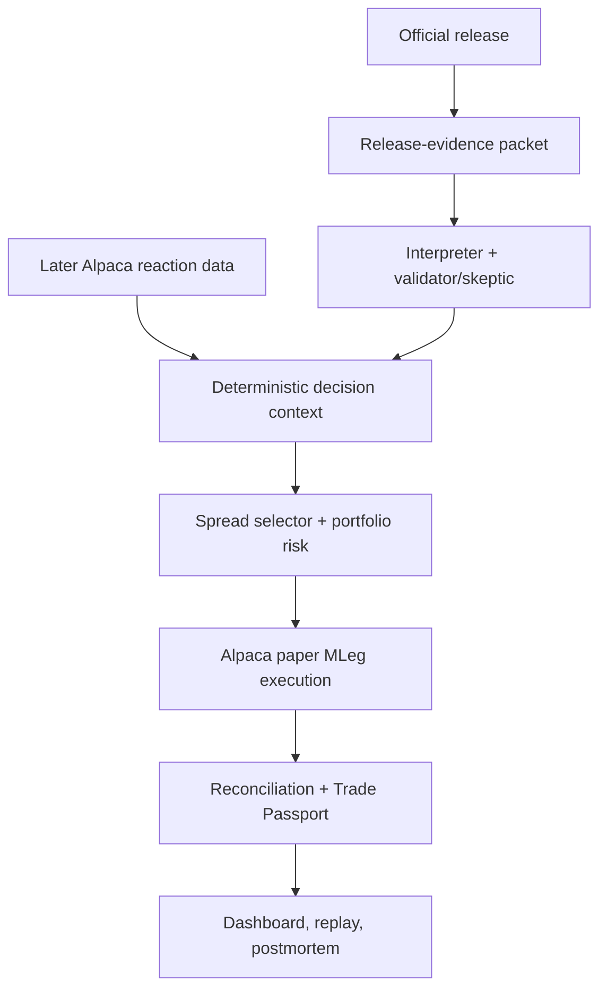
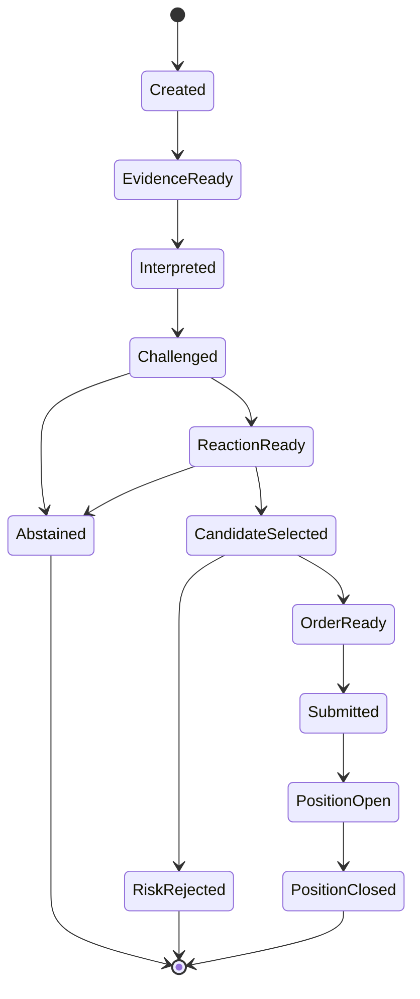

# Aegis Macro Desk

## A realistic 2–3 person plan for the Alpaca AI Trading Agents Hackathon

> **Decision:** Build an evidence-first macro-event options agent that interprets a scheduled economic release, waits for the market to confirm or reject the interpretation, constructs a defined-risk ETF option spread, submits it through Alpaca paper trading, and preserves the complete evidence, veto, order, fill, and P&L trail.

**Prepared:** 30 August 2026
**Planned progression:** IDEATE → SPECIFY → RESEARCH/BUILD → production simulation → PAPER TEST
**Team assumption:** 2–3 people, starting from zero
**Status:** planning document; no strategy results, trades, tests, or performance claims have been produced
**Current gate decision:** **INVESTIGATE** — verify enrollment/rules, approve data, and build the smallest deterministic vertical slice. Transition to **PAPER TEST** only after Gates G0–G4 pass; do not treat either stage as evidence for live-capital deployment.

---

## Contents

- **Decision and constraints:** [1. Decision brief](#1-decision-brief) · [2. Hackathon requirements](#2-what-the-hackathon-actually-requires) · [3. Prompt adaptation](#3-how-the-supplied-small-fund-prompt-changes-our-approach) · [4. Idea selection](#4-idea-portfolio-and-selection-reasoning)
- **Product and finance:** [5. Product definition](#5-product-definition) · [6. Investment hypothesis](#6-investment-hypothesis-and-adversarial-challenge) · [7. Strategy specification](#7-exact-strategy-specification) · [8. Portfolio management](#8-portfolio-management-layer) · [9. Research](#9-research-and-validation-plan) · [10. Trade Passport](#10-trade-passport-the-distinguishing-artifact)
- **Engineering:** [11. Architecture](#11-technical-architecture) · [12. Repository](#12-repository-and-module-design) · [13. Contracts](#13-domain-contracts) · [14. State machines](#14-state-machines-and-broker-truth) · [15. Persistence/API](#15-persistence-and-api) · [16. Testing](#16-testing-and-validation-engineering) · [17. Operations](#17-deployment-and-operations)
- **Execution plan:** [18. Responsibilities](#18-team-structure-and-operating-rhythm) · [19. Seven-day plan](#19-seven-day-build-plan) · [20. Demo and submission](#20-judge-facing-product-and-demo) · [21. Business roadmap](#21-business-lane-and-post-hackathon-roadmap)
- **Decisions and risks:** [22. Risk register](#22-risk-security-and-compliance-register) · [23. Rejected ideas](#23-what-we-deliberately-do-not-build-and-why) · [24. Contingencies](#24-contingency-plan) · [25. Evidence ledger](#25-evidence-ledger-at-plan-completion) · [26. Gate decision](#26-final-gate-decision) · [27. First experiment](#27-smallest-high-information-next-action) · [28. Sources](#28-source-index)

---

## 1. Decision brief

### Recommendation

Build **Aegis Macro Desk**, an adversarial but compact AI investment desk for scheduled US macroeconomic releases. Its first implementation handles releases such as JOLTS and the Employment Situation and expresses accepted theses through **SPY call-debit and put-debit spreads**. QQQ and IWM are post-MVP extensions only.

The product is not “an LLM that predicts the stock market.” Its promise is narrower and more defensible:

> A macro release contains several numbers, revisions, interactions, and ambiguities. Aegis structures that information, checks whether live prices agree, and permits a trade only when a deterministic options, portfolio, liquidity, and risk engine can defend it.

### Why this is the best hackathon choice

1. **The AI has a genuine job.** It interprets multi-field releases, revisions, conflicts, and uncertainty. It is not decorating an RSI strategy with prose.
2. **The hypothesis is falsifiable.** A pre-specified release interpretation plus observable post-release confirmation should predict short-horizon continuation. If it does not, the system abstains or the hypothesis fails.
3. **Options are intrinsic to the product.** Defined-risk vertical spreads convert a directional, time-bounded thesis into a known maximum loss and a visible payoff—not a token option trade added to satisfy a rule.
4. **Portfolio-risk management remains real.** Even with SPY only, the desk allocates a finite maximum-loss budget, aggregates Greeks, maintains cash, prevents overlapping macro bets, and can select no trade. It does not pretend that one underlying creates diversification; QQQ/IWM correlation becomes relevant only after the SPY path is stable.
5. **It is differentiated.** The visible field already contains many technical-indicator, sentiment, bull/bear committee, and generic risk-gate bots. A focused release-reaction desk is easier to remember and easier to test.
6. **It fits a 2–3 person build.** One interpreter is enough for late-start P0; a second skeptic is optional P1. All calculations and execution are deterministic. A working end-to-end slice is feasible before polishing the research or UI.
7. **The demo tells one clean story.** Official release → structured interpretation → market confirmation → option selection → portfolio/risk veto → Alpaca order/fill → attribution.

### Confidence

**Medium** for the project-selection decision. The concept fits the published requirements and provides a credible build path, but no published judging weights exist and the trading edge is **unvalidated**. The plan optimizes for the four main dimensions—P&L, technology implementation, creativity/originality, and presentation/execution—while treating social engagement as a separate optional prize rather than gambling everything on one noisy week of option returns.

### The line we will not cross

We will not claim that a seven-day paper contest validates alpha, that simulated fills represent attainable live fills, or that several AI roles provide genuinely independent confirmation. This is a robust **research and paper-execution prototype**, not a fund-ready strategy.

---

## 2. What the hackathon actually requires

### Verified event facts

| Item | Evidence tag | Verified position as of 30 Aug 2026 | Planning implication |
|---|---|---|---|
| Build window | **Observed** | 28 Aug 2026 08:00 PDT to 4 Sep 2026 08:00 PDT | Deadline is **4 Sep at 15:00 UTC = 16:00 BST = 11:00 EDT**, only 90 minutes after the US options market opens. Submit before 15:00 UTC; do not plan around a full final session. |
| Enrollment precondition | **Conflicting official signals** | The live schedule says registration closed at kickoff on 28 Aug at 15:00 UTC, while the live page still displays “Join Event” and participant counts have continued changing | Confirm every member and the team are enrolled before treating this as a valid competition plan. If not, ask organizers immediately rather than assuming a submission will be accepted. |
| Core challenge | **Observed** | “Options Alpha Agents”: build an autonomous AI trading agent intended to generate P&L | The prototype needs a complete decision and paper-order loop, not only analytics. |
| Required Alpaca stack | **Observed** | Alpaca Trading API plus either the Alpaca MCP Server or Alpaca CLI | Use `alpaca-py` for the controlled runtime and Alpaca MCP for read-only agent research. |
| Options | **Observed** | Every strategy must incorporate options trading | Use option spreads as the actual expression of the thesis. |
| Trading environment | **Observed** | Paper trading against live markets; no real capital | Hard-code paper mode and fail closed if a live endpoint is detected. |
| Competition account | **Observed** | Brand-new dedicated paper account; reused accounts are ineligible; starting balance exactly $100,000; account ID submitted | Create the account before the first competition trade and never reset or mix activity. |
| Written submission | **Observed** | One-page explanation of AI logic, risk gates, and Alpaca infrastructure | Design the architecture and audit trail so the page almost writes itself. |
| Submission package | **Observed** | Project title; short/long descriptions; technology/category tags; cover image; video; slide presentation; public GitHub repository; demo platform; interactive application URL; Alpaca paper account ID; and the one-page AI/risk/infrastructure write-up | Deliver a credential-free online prototype and complete every field. Generic guidance caps video at five minutes in MP4 and expects slides as PDF; the planned four-minute video fits. |
| Judging | **Observed** | P&L performance, technology implementation, creativity/originality, and presentation/execution; no weights published | Use a dual scorecard: competition evidence and fund-quality engineering. |
| Prizes | **Observed** | Detailed page labels the total **$6,300**: $2,500 cash + $300 Featherless credits for first; $1,500 cash for second; $1,000 cash for third; and two $500/team social prizes, each also including one month of Alpaca Algo Trader Plus per member. The header separately says **$6,000 Prize Pool**, corresponding to cash. | Treat $6,000 as cash and $300 as non-cash credits; do not build around sponsor credit. |
| Social challenge | **Observed** | Separate optional build-in-public challenge on X and/or LinkedIn. Tag both lablab.ai and Alpaca and submit up to five post URLs; selection may consider usefulness/creativity/quality and engagement. | Keep it separate from main judging and select no more than five URLs for the final social submission. |
| Eligibility | **Observed** | Entrants must be 18+. Alpaca employees/contractors, their immediate family or household members, and participants from sanctioned countries are excluded; void where prohibited. | Confirm eligibility for every member before building. |
| Team registration | **Generic lablab rule** | Every member registers independently and belongs to a lablab team; teams may have at most six people. | The proposed 2–3 person team fits the cap. |
| Originality/license | **Observed** | Submissions must be original and “MIT-compliant,” and a public GitHub repository is required. “MIT-compliant” is not defined. | Use an explicit MIT LICENSE and audit dependency/asset compatibility as the conservative implementation. |

Primary event sources: [event page](https://lablab.ai/ai-hackathons/alpaca-ai-trading-agents-hackathon) and [live dashboard](https://lablab.ai/ai-hackathons/alpaca-ai-trading-agents-hackathon/live). Generic platform rules: [lablab guide](https://lablab.ai/guide), [submission guidelines](https://lablab.ai/delivering-your-hackathon-solution), [getting-started guide](https://lablab.ai/getting-started-guide), and [rulebook](https://lablab.ai/hackathon-rules).

Prize terms say awards are paid to individuals, not companies; a winning team designates one recipient or confirms a split. Payment requires the applicable US/non-US tax form, photo ID, bank details, and sanctions screening and may take up to 90 days. Tax treatment is jurisdiction- and treaty-specific.

### Published ambiguities we would resolve immediately

These do not block the architecture, but they affect tactics:

1. What exact P&L measure is judged: realized P&L, total account equity, net liquidation value, or another snapshot?
2. At what timestamp is performance frozen, and must all positions be closed?
3. Are risk, drawdown, or capital efficiency considered, or only absolute P&L?
4. What market-data entitlement does the dedicated competition account receive?
5. Does “incorporate options” require at least one filled options order? We would assume **yes**; if organizers confirm it, the absence of an eligible fill is competition-blocking rather than a mere demo limitation.
6. Are resets, cancelled accounts, or trades placed before team registration disqualifying?
7. The event page itself lists the one-page write-up, video, and slides, so they are cumulative; only exact format/length details come from generic lablab guidance.
8. The legal section says no purchase or Alpaca account is required, but an eligible judged submission must provide a fresh $100,000 paper-account ID. Safest reading: no account is required merely to register; the dedicated account is mandatory for judging.

### Known platform constraints that shape scope

- Alpaca Basic supplies IEX-only real-time equities and the options Indicative Pricing Feed; its indicative option quotes are modified derivatives of OPRA data and indicative trades are delayed by 15 minutes. Algo Trader Plus adds all-US-exchange equity coverage and OPRA options. Basic also limits subscriptions/call rates and access to the latest historical window. Record the actual feed on every observation, require OPRA for execution-quality/liquidity claims, and otherwise label the evidence `INDICATIVE / DATA_LIMITED`. A compact universe and continuous event-time recording are essential because immediate REST gap repair may be unavailable. [Alpaca market-data plans](https://docs.alpaca.markets/us/docs/about-market-data-api) and [historical option feed definitions](https://docs.alpaca.markets/us/docs/historical-option-data)
- Paper trading does not model market impact, order leakage, latency slippage, queue position, price improvement, regulatory fees, dividends, or borrow fees. Paper quantity is not capped by displayed NBBO size, and the documentation does not specify a separate MLeg simulator-fill model. Every fill and P&L number remains paper-simulation evidence, never an execution-quality claim. [Alpaca paper-trading limitations](https://docs.alpaca.markets/us/docs/paper-trading)
- Alpaca options history begins only in February 2024, which limits event sample size and rules out grand claims based on decades of options data. [Historical option data](https://docs.alpaca.markets/us/docs/historical-option-data)
- Options are not an extended-hours product. An 08:30 ET release may be interpreted immediately, but any option order must wait for the regular session. [Alpaca options documentation](https://docs.alpaca.markets/us/docs/options-trading)
- Alpaca supports atomic multi-leg option orders, including debit spreads. [Multi-leg options documentation](https://docs.alpaca.markets/us/docs/options-level-3-trading)
- Alpaca MCP Server v2 exposes account, market-data, news, watchlist, and trading toolsets and supports toolset filtering. The LLM-facing process enables only `assets,stock-data,options-data,news,corporate-actions`; it omits `account`, `trading`, and `watchlists` and sits behind an exact getter allowlist. [Alpaca MCP Server](https://docs.alpaca.markets/us/docs/alpaca-mcp-server)

---

## 3. How the supplied small-fund prompt changes our approach

The prompt is absorbed as the operating constitution, but it must be compressed for a hackathon.

### What we preserve

- hypotheses must be falsifiable;
- observed facts, assumptions, inferences, computed values, and unknowns remain distinct;
- no fabricated prices, news, quotes, Greeks, results, fills, or tests;
- the equity thesis and the options expression are separate decisions;
- portfolio risk is allocated across positions rather than treating each trade in isolation;
- the risk validator can veto progression;
- `NO TRADE`, `NEEDS_DATA`, and `NOT RUN` are valid outputs;
- research, backtest, paper, and live evidence are never blurred;
- an LLM never silently chooses quantity, strikes, prices, or risk limits;
- every paper order has a traceable evidence and control record.

### What we compress

Running eight prose agents in the live order path would be slow, fragile, expensive, and mostly theatrical. The full investment committee operates at three points only:

1. strategy admission;
2. material parameter changes;
3. daily/post-event review.

The online path is compact:

> ingest → interpret → challenge → quantify → select structure → allocate risk → validate → execute → reconcile → monitor

The full version has at most two probabilistic components:

- **Release Interpreter:** structures the release and describes competing interpretations.
- **Skeptic:** finds missing fields, revisions, contradictions, stale inputs, and reasons to abstain.

For a two-person team starting on 30 August, P0 uses only the Release Interpreter. A deterministic evidence validator produces the same `SkepticAssessment` contract for missing fields, stale inputs, revision conflicts, and provenance failures. The second LLM is P1; it is never allowed to delay the money-path controls.

Everything numerical—features, Greeks, option selection, sizing, portfolio constraints, scenario loss, order construction, and state transitions—is specified as deterministic and must pass tests before paper use.

### Roles mapped to a 2–3 person build

| Fund lens | Hackathon responsibility | Primary deliverable |
|---|---|---|
| CIO / Portfolio Manager | Own the one-sentence product, competition/fund scorecards, risk budget, final gate | Decision log and portfolio policy |
| Equity Quant | Specify the post-release confirmation hypothesis and baselines | Signal specification and event replay |
| Options / Vol Quant | Define vertical-spread selection, liquidity, lifecycle, Greeks, and scenario rules | Option-selection and payoff engine |
| Data / Backtest | Timestamp sources, freeze datasets, prevent leakage, label unavailable evidence | Evidence manifest and validation report |
| Quant Developer | Build ingestion, schemas, services, persistence, replay, and observability | Working vertical slice |
| Execution Researcher | Build limit-order policy, duplicate prevention, streaming updates, and reconciliation | Order state machine |
| Independent Risk / Validator | Implement veto rules, failure injection, kill switch, and NOT-RUN ledger | Risk decision record and test suite |
| Operations / Compliance | Verify rules/account, secrets, paper-only mode, licensing, and submission completeness | Competition checklist |
| Added Product / Demo Lead | Own UI, video, slides, one-page narrative, cover, and social posts | Judge-ready package |
| Added Agent-Security Owner | Structured outputs, tool allowlist, prompt-injection defense, timeout/fallback policy | Agent evaluation and security tests |

In a three-person team, product/demo is a real lane. In a two-person team, it merges with quant/product rather than becoming an afterthought.

The virtual fund roles remain review lenses, not extra chat agents. No person authors and approves the same strategy or risk-policy change: a peer reviews the versioned diff before the prior-market-close freeze. In the two-person configuration, Person A owns the thesis and Person B owns execution/risk-code review; either may veto, and neither may waive a failed automated gate.

---

## 4. Idea portfolio and selection reasoning

### Decision criteria

We rank ideas using an **illustrative**, pre-build scorecard. Scores are judgment, not measured evidence.

| Criterion | Weight | Question |
|---|---:|---|
| Originality / memorability | 20% | Will judges remember the problem after seeing many trading bots? |
| Meaningful AI contribution | 15% | Does AI solve an unstructured reasoning problem rather than decorate rules? |
| Finance credibility | 15% | Is there a plausible mechanism, defined risk, and falsifiable claim? |
| Build feasibility | 20% | Can 2–3 people build a working vertical slice from zero in the first 24 hours? |
| Alpaca showcase | 15% | Does it visibly use data, options, paper orders, MCP, and lifecycle handling? |
| Demo / presentation | 15% | Can a judge understand and verify the value in 30 seconds? |

### Ranked concepts

| Rank | Concept | Weighted view | Why it could win | Why it is not the final choice |
|---:|---|---:|---|---|
| 1 | **Aegis Macro Desk** | **4.6 / 5** | Focused language problem, scheduled events, falsifiable reaction signal, defined-risk options, excellent audit/demo path | **Selected.** Its main weakness is small sample size and few live opportunities. |
| 2 | General catalyst-to-convexity desk | 4.2 / 5 | Extends to earnings and company news; more opportunities | Broader event taxonomy, source quality, entity resolution, and event-specific models create too much scope and make the story less sharp. |
| 3 | RiskTwin portfolio hedge compiler | 3.9 / 5 | Strong portfolio-management product; excellent scenario visualization | A hedge can lose money in a calm/up week and lacks its own alpha source; best retained as Aegis's scenario/risk module. |
| 4 | Volatility Auction / event-IV agent | 3.6 / 5 | Most options-native concept; agents compete for vega/gamma risk | Credible implied-versus-expected distribution work needs better point-in-time option history and surface research than the sprint allows. |
| 5 | Execution Sentinel | 3.5 / 5 | Real operational value; strong Alpaca integration; self-healing orders | Execution quality is not an alpha thesis. Retain it as Aegis's order/reconciliation layer. |
| 6 | Generic news-sentiment trader | 2.7 / 5 | Easy to build and demo | Crowded, difficult to validate, and sentiment alone is not a durable edge. |
| 7 | Deep-RL allocation agent | 2.1 / 5 | Sounds technically ambitious | Training, validation, explainability, and data requirements are incompatible with a seven-day build from zero. |

### The selected synthesis

Aegis deliberately absorbs the best modules from three concepts without becoming a strategy zoo:

- **Post-release continuation** supplies the focused alpha hypothesis; macro-event interpretation conditions data quality, channel mapping, and abstention.
- **RiskTwin** supplies portfolio scenario analysis and before/after exposure views.
- **Execution Sentinel** supplies reliable order state, duplicate prevention, and reconciliation.

One strategy, one universe, two option templates, one coherent demo.

---

## 5. Product definition

### Target user

A small systematic investment team or sophisticated research desk that wants to automate macro-event reaction research and paper execution **without allowing an LLM to invent risk or order parameters**.

The hackathon user is the judge; the product user after the hackathon is the CIO/quant developer who needs to answer:

- What did the release actually say?
- Which parts were surprising, revised, or contradictory?
- Did the market confirm the interpretation?
- Why was this instrument and spread selected?
- How much portfolio risk changed?
- Which gate approved or vetoed the order?
- What happened after submission?
- Was P&L due to direction, implied volatility, time decay, or execution?

### Value proposition

> Turn complex economic releases into auditable, defined-risk paper trades—with AI handling interpretation and deterministic systems handling calculations, constraints, and broker state.

### Testable role for AI

Rules can parse known table cells, but economic releases often include revisions, conflicting subcomponents, caveats, qualitative context, and changing wording. The LLM's job is to create a structured interpretation and expose uncertainty. It cannot authorize or parameterize a trade.

We will test whether the AI earns its complexity by comparing it with:

1. a deterministic headline parser;
2. price-only confirmation;
3. the same option policy with no language interpretation;
4. cash / no trade.

This comparison is **NOT RUN** at planning time. If the AI lane adds no out-of-sample value, the honest conclusion is that the interpretation layer did not earn its complexity.

### MVP boundary

| Included | Excluded from MVP |
|---|---|
| JOLTS and Employment Situation release types | Earnings, social media, unscheduled company news |
| SPY only; QQQ/IWM after the MVP is stable | Full S&P 500 or single-name universe |
| Bull call debit spread | Naked calls/puts, calendars, diagonals, condors |
| Bear put debit spread | Dynamic delta hedging |
| 7–21 DTE, regular-hours execution | 0DTE and expiration-day management |
| One open macro risk cluster by default | Multi-strategy portfolio optimization |
| Alpaca paper environment only | Live account support |
| Explicit live-paper, recorded-paper, historical-replay, and synthetic-mock modes | Consumer onboarding, deposits, or brokerage UI |
| Web dashboard and read-only evidence query | General-purpose trading chatbot |

---

## 6. Investment hypothesis and adversarial challenge

### Pre-registered hypothesis

> **H1:** After a scheduled US macro release becomes public, a materially one-sided interpretation that is confirmed by SPY price and volume over a fixed observation window may produce continuation over the following intraday horizon. A capped-loss SPY vertical spread may express that view when its spread cost, quote quality, and portfolio risk pass pre-declared gates.

This is a hypothesis, not a result. The null is:

> **H0:** After realistic delays and option spread costs, the language interpretation adds no predictive or economic value beyond price-only momentum, an underlying SPY trade, or cash.

### Proposed mechanism

Scheduled releases are often reduced to one headline even though revisions and subcomponents can change the interpretation. Different market participants may update at different speeds because they:

- focus on different subcomponents;
- have different rate-versus-growth exposures;
- rebalance hedges after the first move;
- wait for cross-asset or price confirmation;
- cannot or do not want to trade the first seconds of a release.

Aegis does **not** attempt to beat institutional news systems on latency. It targets a possible second-wave repricing after the initial release is observable and market agreement is measurable.

### Who takes the other side?

The counterparty may be:

- a market maker hedging rather than expressing a macro view;
- an investor reducing or adding portfolio exposure for reasons unrelated to the release;
- a faster trader taking profit after the initial reaction;
- an options participant with a different volatility or path view;
- a trader who interprets rates, growth, revisions, or positioning differently.

Their willingness to trade is rational; it is not proof that Aegis possesses an edge.

### Strongest objections

| Objection | Response in design | Remaining uncertainty |
|---|---|---|
| Liquid index markets absorb macro news almost immediately | Wait for a fixed confirmation window and test continuation, not first-tick reaction | The residual opportunity may disappear after costs |
| “Good” employment data can be bullish growth or bearish rates | Interpreter must expose competing channels; mixed evidence forces abstention | Regime classification may itself be unstable |
| SPY price confirmation may do all the useful work | Run AI-off and price-only ablations | **NOT RUN** until evaluated |
| A debit spread caps upside and crosses two option markets | Compare with SPY shares and a long single option | Options superiority is **NOT RUN** |
| Several AI personas are correlated | Use only one interpreter and one skeptic; deterministic risk is the hard veto | The skeptic is still not independent empirical confirmation |
| One week supplies too few events | Use point-in-time historical release replays where the option evidence exists; otherwise use clearly synthetic fixtures | Alpaca option history since Feb 2024 still gives a small sample and does not guarantee historical quote-chain reconstruction |

### What would falsify the idea?

Any of these would be sufficient to stop or materially change the thesis:

- the price-only baseline matches or beats the AI lane after costs;
- continuation disappears when entry is delayed to a realistically executable time;
- results depend on one release, one threshold, or one regime;
- realistic bid/ask crossing turns gross expectancy negative;
- the interpreter cannot reliably capture revisions and conflicting subcomponents;
- abstention/calibration is poor, so higher confidence does not correspond to better outcomes;
- live paper quotes or MLeg behavior are too incomplete for the strategy rules;
- conservative shadow P&L materially diverges from the official paper P&L;
- the system cannot reconcile an order or broker position reliably after restart.

### Investment-committee views

| Role | View | Strongest support | Strongest objection | Confidence |
|---|---|---|---|---|
| CIO / PM | Build the narrow SPY prototype; preserve cash as the default allocation | Strong hackathon fit and coherent risk story | Unvalidated edge and noisy P&L judging | Medium |
| Equity Quant | Test post-release continuation, not prediction | Falsifiable, timestamped event design | SPY may incorporate the information before entry | Low–medium |
| Options / Vol Quant | Debit verticals are an acceptable bounded expression | Known maximum loss and atomic MLeg execution | Two-leg spread costs may dominate; stock may be better | Medium on structure, low on superiority |
| Data / Backtest | Data approval is the critical gate | Official release archives and Alpaca bars exist | Point-in-time consensus and options sample are weak | Low–medium |
| Quant Developer | Vertical slice is feasible with strict scope | Official Python SDK, streams, MCP, and MLeg support | Live streams and broker reconciliation can consume the sprint | Medium–high |
| Execution Researcher | Limit-only atomic spreads with bounded repricing | Alpaca exposes MLeg and trade updates | Indicative data and optimistic paper fills distort execution quality | Medium |
| Risk / Validator | Permit paper testing only | Defined maximum loss and hard fail-closed controls | Contest incentives reward variance; Friday deadline adds operational risk | Medium |
| Operations / Compliance | Proceed after account/rules/secrets checklist | Explicit paper environment and dedicated account | Rule ambiguities and public-performance communications | Medium |

There is no forced consensus: the team agrees that the **prototype** is worth building, while the existence and economic value of the **strategy edge** remain unresolved.

---

## 7. Exact strategy specification

All numerical thresholds below are **Illustrative** until frozen before the first replay/live event and tested. They are not recommendations or observed results.

### 7.1 Instruments, event universe, and clock

| Field | MVP specification |
|---|---|
| Underlying | SPY |
| Option structures | Bull call debit spread; bear put debit spread |
| Release types | JOLTS and Employment Situation first; Productivity/Costs only if the same adapter works without a new taxonomy |
| Release source | Allowlisted official government page or feed; source URL, retrieval time, publication time, and content hash required |
| Market data | Alpaca SPY bars/quotes and option chain/snapshots; feed type recorded |
| Decision timezone | America/New_York, stored internally in UTC |
| Entry regime | Post-release only; no anticipatory position |
| Holding period | Intraday by default; no position held into expiration |
| Competition mode | Alpaca paper account only |

For the actual 2026 event week, the BLS schedule lists JOLTS at 10:00 ET on 1 September, Productivity and Costs at 08:30 ET on 3 September, and Employment Situation at 08:30 ET on 4 September. [BLS September 2026 release calendar](https://www.bls.gov/schedule/2026/09_sched_list.htm)

### 7.2 Event evidence schema

Every release becomes a versioned `MacroRelease` with:

- `event_id` and `release_type`;
- official `source_url`;
- scheduled, observed-publication, and received timestamps;
- raw content hash and parser/model/config versions;
- current actual values;
- previously published values;
- revisions, with old and new values;
- optional point-in-time consensus values and their source/timestamp;
- parser validation status, missing fields, and reasons the record may be unusable.

The raw release object contains sourced facts only. A canonical `ReleaseEvidencePacket` wraps the release, evidence fragments, schema/version fields, and packet hash. It contains **no SPY reaction data**, preventing the interpreter from seeing the answer supplied by the later confirmation rule.

Consensus is **optional but never invented**. If no timestamped, permitted source is available, the system cannot claim an expectation surprise. It can still test a narrower reaction-confirmation hypothesis using actual/revision structure and market action, but the Trade Passport must say `consensus_status: NEEDS_DATA`.

### 7.3 Release interpretation

The interpreter receives only the `ReleaseEvidencePacket` and emits strict JSON, not a trade:

```json
{
  "release_id": "bls-employment-2026-08",
  "source_evidence_ids": ["evidence-001", "evidence-002"],
  "growth_signal": "stronger|weaker|mixed|unknown",
  "inflation_signal": "hotter|cooler|mixed|unknown",
  "rates_impulse": "hawkish|dovish|mixed|unknown",
  "risk_asset_direction": "bullish|bearish|mixed|unknown",
  "confidence": 0.0,
  "bullish_evidence": [],
  "bearish_evidence": [],
  "contradictions": [],
  "missing_fields": [],
  "invalidation": "string"
}
```

The deterministic evidence validator in late-start P0—or an LLM skeptic in P1—receives the same release-evidence packet plus the validated interpretation and emits a separate `SkepticAssessment` containing `veto`, `confidence_cap`, contradictions, and missing fields. It cannot increase confidence or propose more risk. It may:

- accept the evidence as complete;
- reduce confidence;
- mark the direction mixed;
- request missing data;
- reject stale or contradictory inputs;
- force `ABSTAIN`.

The deterministic merge rule is:

1. effective confidence is `min(interpreter_confidence, skeptic_confidence_cap)` for display/calibration only;
2. any skeptic veto, critical missing field, or unresolved contradiction produces `NO_TRADE`;
3. only after both outputs are stored does code create a `ReactionSnapshot` from post-window SPY data;
4. a `DecisionContext` combines release interpretation, skeptic assessment, and reaction snapshot inside deterministic code;
5. price selects direction; a valid mapped language direction may agree or veto, never override price or increase risk.

`confidence` is the model's self-rated confidence in the completeness/coherence of its release interpretation, not a probability that SPY or the spread will profit. It is not Brier-scored. Any future binary continuation probability must be a new, separately defined and versioned field with an exact horizon/outcome.

Release text is untrusted data. Instructions embedded in a page or news item never become system instructions and cannot call tools.

### 7.4 Deterministic signal features

The first version uses few features with fixed windows.

#### Optional standardized surprise

For component $j$, where a valid point-in-time consensus exists:

\[
z_{j,t} = d_j\frac{A_{j,t}-C_{j,t}}{\sigma_{j,\text{forecast error}}}
\]

where:

- $A_{j,t}$ is the published actual;
- $C_{j,t}$ is the timestamped consensus;
- $d_j \in \{-1,+1\}$ aligns the component with the declared risk-asset interpretation;
- the scale uses only prior release forecast errors.

If forecast-error history is not available, use a simple actual-minus-consensus field as **descriptive evidence**, not a standardized signal.

#### Revision contribution

\[
R_t = \sum_j w_j d_j \frac{P^{new}_{j,t-1}-P^{old}_{j,t-1}}{s_j}
\]

where the weights and scaling $s_j$ are frozen before evaluation. Revisions never disappear behind the headline.

#### Price confirmation

For each event type and its own pre-declared clock, calculate:

\[
r_{e}=\log(P^{end}_{e}/P^{anchor}_{e})
\]

and a robust same-clock normalization using only prior sessions:

\[
m_e=\operatorname{median}(r_{e,\text{prior 60 sessions}}),\qquad
s_e=\max\left(1.4826\operatorname{MAD}(r_{e,\text{prior 60 sessions}}),\epsilon_r\right)
\]

\[
z_e = \frac{r_e-m_e}{s_e}
\]

The return floor $\epsilon_r$ is frozen from tick-size/data-resolution analysis rather than fitted to outcomes. Fewer than the required prior observations or a raw MAD below the declared reliability floor produces `NEEDS_DATA`; the system does not manufacture an extreme z-score from a near-zero denominator.

The system also calculates:

- deviation from the pre-declared **event-window VWAP**, not session-to-date VWAP;
- post-release range and reversal;
- volume divided by the median volume in the identical clock window over the prior 20 sessions;
- quote/data age;
- whether the sign agrees with the interpreter.

No same-bar fantasy fill is allowed. A signal observed at the end of a window may only use an option quote observed afterward.

The initial **Illustrative** eligibility rule is `abs(z_e) >= 1.0`, same-window volume ratio at least `1.25`, and the final midpoint on the same side of event-window VWAP as `sign(z_e)`. These values must be frozen before a replay/final event and tested at neighbouring values.

#### Event-specific fields and clocks

JOLTS and Employment Situation are not pooled as homogeneous observations.

| Release | Required extraction fields | Deterministic clock | First eligible option action | Evaluation horizon |
|---|---|---|---|---|
| JOLTS, 10:00 ET | Job openings, hires, quits, layoffs/discharges, total separations, and published revisions | Pre-anchor: median SPY midpoint 09:55–09:59; confirmation: VWAP/volume 10:00–10:14; freeze signal at 10:15 | Fresh quote strictly after 10:15 | Entry to the pre-registered exit-start/flat-by times |
| Employment Situation, 08:30 ET | Payrolls, unemployment rate, average hourly earnings, participation, and payroll revisions | Premarket anchor 08:25–08:29; reaction 08:40–08:44; regular-session VWAP 09:30–09:34; follow-through 09:40–09:44; freeze at 09:45 | Fresh quote strictly after 09:45 | Separate 09:45-to-10:30 research label; **observation/replay only during this hackathon because the 11:00 EDT deadline is too close** |

Each event type uses its own same-clock volatility/volume baseline and chronological evaluation. A result from one is not silently combined with the other.

#### Language role and direction

At MVP, the deterministic price rule selects direction: `BULLISH` when the eligible $z_e$ is positive and `BEARISH` when it is negative. The LLM is an extraction, contradiction, interpretation, and veto layer—not a free-standing directional oracle.

- Without a timestamped consensus, the model may not infer an unstated market expectation from its training data or call a value a “surprise.”
- JOLTS and Employment field/channel mappings are versioned separately.
- `MIXED`, missing critical fields, or a material headline/revision contradiction forces abstention.
- If a valid consensus/mapping exists and the interpreter's risk-asset direction conflicts with price, abstain.
- Model confidence is displayed for later calibration but cannot increase eligibility, size, or risk until out-of-sample calibration exists.
- Evaluation preserves four separate outcomes: signed SPY continuation return; Alpaca paper spread P&L; recorded quote-side shadow spread P&L; and the decision-reference-to-fill execution-cost estimate. They are never collapsed into one “cost-adjusted result.”

#### Composite decision

The MVP should prefer a transparent decision table over an optimized weighted score:

| Interpreter/evidence state | Deterministic market confirmation | Result |
|---|---|---|
| Complete, no critical contradiction; direction agrees where a valid mapping exists | Eligible positive $z_e$, volume, and VWAP gates pass | Candidate bull call spread |
| Complete, no critical contradiction; direction agrees where a valid mapping exists | Eligible negative $z_e$, volume, and VWAP gates pass | Candidate bear put spread |
| Mixed/unknown/missing critical field | Any | Abstain |
| Valid mapped interpretation | Opposite price direction | Abstain |
| Complete | Confirmation below threshold | Abstain |
| Any | Stale/missing source or market data | `NEEDS_DATA` / veto |

This prevents a fitted “magic score” from hiding the actual logic.

### 7.5 Decision and order timing

For a release at regular-market time $T$:

1. receive and hash the release;
2. validate required fields;
3. run the interpreter and deterministic validator/optional skeptic;
4. wait until the fixed confirmation window closes;
5. compute price/volume features;
6. fetch a new option chain/snapshot;
7. select and risk-check the spread;
8. submit no earlier than the first quote after all inputs are observable.

For the 10:00 ET JOLTS release, the first eligible option snapshot is after the 10:15 signal freeze. For an 08:30 ET release, interpretation may occur before the open, but options cannot trade until the regular session; the separate Employment clock freezes at 09:45. During this event, the Employment release is an observation/replay case only because the submission cutoff is approximately 11:00 EDT.

### 7.6 Option selection

Candidate contracts must satisfy all of the following:

- exact `root_symbol=SPY`, same underlying and expiration, and active/tradable contract status;
- returned contract `size == "100"`; adjusted or otherwise non-standard deliverables are vetoed as `NON_STANDARD_CONTRACT`;
- 7–21 calendar days to expiration in the research design; the contest MVP may narrow to 7–14 DTE;
- no 0DTE;
- long call delta approximately 0.55–0.65 for bullish trades, or long put absolute delta approximately 0.55–0.65 for bearish trades;
- short leg absolute delta approximately 0.25–0.35;
- valid two-sided quotes, midpoint greater than zero, and non-null required fields;
- quote age below an illustrative 5-second limit;
- no crossed or locked quote;
- each leg's bid/ask width below an illustrative 20% of midpoint;
- minimum open interest with its `open_interest_date`, frozen after inspecting feed availability rather than outcomes; same-day volume is optional and becomes a hard gate only when derived from timestamped bars/trades over a declared interval;
- strict `0 < maximum acceptable debit < spread width`;
- illustrative maximum acceptable debit no greater than 50% of width, giving at least 1:1 expiry maximum-profit/maximum-loss before costs;
- package `net_mid = mid_long - mid_short`, natural debit `ask_long - bid_short`, package cost percentage, displayed size, maximum acceptable debit, and feed type are all recorded;
- maximum loss within the remaining risk budget;
- expiration lies safely beyond the competition window, the contract is not liquidation-only, and no overnight holding is planned; `DTE > 0` does not eliminate early-assignment risk on the short American-style leg.

After hard filtering, candidate ranking is a versioned lexicographic sort rather than a dimensionally vague score:

1. lowest package natural-debit premium over net midpoint, as a percentage of midpoint;
2. smallest distance from the long/short target deltas;
3. closest DTE to the frozen target;
4. lowest maximum acceptable debit;
5. stable contract-symbol tie-break.

If Greeks are missing or the feed cannot support the eligibility rule, return `NO_CONTRACT` rather than interpolate silently. If the account has only the indicative options feed, every quote and result is labelled `INDICATIVE`; it is not described as NBBO-quality or execution-quality evidence.

### 7.7 Payoff and Greeks

For a validated standard SPY contract, use the contract size returned by Alpaca as multiplier $M$ and require $M=100$; never infer the multiplier from the asset class. For a bull call debit spread with lower strike $K_L$, upper strike $K_S$, net debit $D$, and quantity $q$:

\[
\text{ExpiryMaxLoss}=D M q
\]

\[
\text{MaxProfit}=((K_S-K_L)-D) M q
\]

\[
\text{Breakeven}=K_L+D
\]

For a bear put debit spread with long higher strike $K_L$, short lower strike $K_S$:

\[
\text{ExpiryMaxLoss}=D M q
\]

\[
\text{MaxProfit}=((K_L-K_S)-D) M q
\]

\[
\text{Breakeven}=K_L-D
\]

These are contractual expiration bounds before fees. An enforced early liquidation through severely widened/crossed markets can create additional operational cost, especially if broker state is incomplete. The system therefore records both `expiry_max_loss` and a more conservative `operational_loss_budget` containing maximum-entry debit, round-trip fees, and a forced-exit buffer.

Portfolio delta, gamma, vega, and theta are computed by summing signed leg Greeks times multiplier and quantity. Large scenario moves use full option repricing when the required inputs/model are available; local Greeks are not presented as accurate for large shocks.

### 7.8 Position sizing and portfolio allocation

The $100,000 competition account is treated as a fund mandate, not an invitation to maximize variance.

Illustrative initial limits:

| Limit | Provisional policy | Rationale |
|---|---:|---|
| Normal per-trade maximum loss | 0.50% of equity ($500 initially) | Keeps a single interpretation error survivable |
| Aggregate open maximum loss | 1.50% | Prevents stacking correlated macro risk |
| Concurrent macro positions | 1 in MVP | SPY is the only underlying and release views overlap |
| Daily loss pause | 1.00% from day's starting equity | Stops repeated failure within one session |
| Competition drawdown kill | 2.50% from high-water mark | Preserves capital and credibility |
| Delta-equivalent notional | 20% of equity | Bounds directional leverage |
| Gamma curvature under a 1% SPY move | 0.10% of equity | Bounds nonlinear directional acceleration |
| Absolute vega per one volatility point | 0.10% of equity | Bounds IV-shock sensitivity |
| Absolute theta per day | 0.05% of equity | Bounds decay burden |
| P0 operational-loss stress | 0.60% of equity | Maximum entry debit plus fees and a fixed forced-exit/liquidity buffer; verified full repricing is P1 |
| Option order type | MLeg limit only | Bounds execution and avoids leg risk |
| Averaging down | Prohibited | Prevents thesis drift and martingale behavior |
| Expiration exposure | Prohibited | Avoids assignment, pin, and deadline risk |

Quantity separately respects contractual loss and operational stress:

\[
q_{expiry}=\left\lfloor\frac{B_{expiry}}{M D_{max}}\right\rfloor,\qquad
q_{operational}=\left\lfloor\frac{B_{operational}}{M D_{max}+F_{roundtrip}+L_{\text{forced exit}}}\right\rfloor
\]

\[
q=\min(q_{expiry},q_{operational},q_{delta},q_{gamma},q_{vega},q_{theta},q_{buying\ power})
\]

$B_{expiry}$ is the remaining 0.50%-per-trade and aggregate contractual-loss budget; $B_{operational}$ is the remaining 0.60% operational-stress budget. $M$ is the validated contract multiplier, $D_{max}$ is the maximum permitted entry debit per share, $F_{roundtrip}$ is the per-spread fee estimate, and $L_{\text{forced exit}}$ is the fixed forced-exit/liquidity buffer per spread. Each Greek/notional quantity is the largest integer that preserves its corresponding cap under the proposed before/after portfolio. If any bound is unavailable or $q<1$, the result is no trade. Pending orders reserve risk at their full maximum limit debit and stress until cancelled and reconciled.

For a portfolio gamma reported per $1 move in SPY, the illustrative curvature check is $0.5\lvert\Gamma_{portfolio}\rvert(0.01S)^2$. Its units, contract multiplier, and quote timestamp are fixed in the risk schema; the system does not compare a raw Greek to a dollar budget.

Before any Greek becomes a hard gate, a contract test verifies the Alpaca convention for delta, gamma, vega per one volatility point, theta horizon, multiplier application, and sign. Both-leg Greek timestamps must be within the declared maximum skew. An unverified unit or stale/misaligned pair produces `BROKER_GREEK_CONVENTION_UNVERIFIED` and no paper order; the dashboard never silently rescales a Greek by 100.

Daily-loss and high-water switches use the lower of broker-reported equity and conservative quote-side shadow-liquidation equity. For an open debit spread, the shadow liquidation value is `(long-leg bid - short-leg ask) × M × q`, using synchronized timestamps and the recorded feed. If the quotes are indicative, the value is labelled `INDICATIVE / DATA_LIMITED`, not executable. Confidence cannot increase any risk allowance.

Cash is a real portfolio allocation. The PM does not force trades to satisfy a desired activity level.

### 7.9 Pre-trade risk gates

An order is eligible only if every hard gate passes:

1. dedicated competition account ID matches configuration;
2. account is active, unblocked, and paper-only;
3. live endpoint cannot be resolved from configuration;
4. event source is allowlisted, timestamped, hashed, complete, and fresh;
5. interpreter output passes schema validation;
6. skeptic has not vetoed;
7. fixed market-confirmation rule passes;
8. market-data feed and age are recorded and acceptable;
9. the account reports both `options_approved_level >= 3` and `options_trading_level >= 3`; each contract is active/tradable; and a controlled paper MLeg smoke test has passed;
10. both legs are tradable and satisfy DTE/delta/liquidity rules;
11. MLeg geometry, ratios, intents, debit, and maximum loss are valid;
12. order does not duplicate an existing event/thesis/order key;
13. broker-reported `options_buying_power` is sufficient;
14. per-trade and aggregate maximum loss, pending-order reservations, delta/gamma/vega/theta caps, and adverse-stress limits all remain within policy;
15. daily loss and high-water drawdown switches are clear;
16. exit can occur before the event/competition deadline;
17. broker state and local ledger reconcile;
18. kill switch is not active.

The AI cannot waive a gate, increase size, alter a strike, or rewrite an Alpaca order.

### 7.10 Execution policy

- Construct a `LimitOrderRequest` with `type=OrderType.LIMIT`, `order_class=OrderClass.MLEG`, whole-number `qty=q`, `time_in_force=TimeInForce.DAY`, `extended_hours=False`, no top-level `symbol` or `side`, and exactly two `OptionLegRequest` objects. Each leg carries `symbol`, `ratio_qty=1`, `side`, and `position_intent`. Use positive `limit_price=+D` for a debit entry, negative `limit_price=-C` for a credit close, and positive `limit_price=+D_{close}` when adverse/crossed package quotes require paying a bounded debit to close. For SPY options, quantize the package price to a penny and no more than two decimals.
- Generate a deterministic, unique `client_order_id` from account, event, thesis version, action, and attempt. This is a correlation and duplicate-prevention key—not an HTTP idempotency guarantee.
- Persist `SUBMITTING` before the request. On an ambiguous timeout, query Alpaca by `client_order_id` before deciding whether any later submission is allowed.
- Start near a conservative quote-side decision reference derived from the combined leg quotes.
- Permit at most a small, pre-declared number of price improvements toward the maximum acceptable debit.
- Never cross beyond the validated maximum debit.
- Cancel after a fixed time-to-live.
- Do not blindly retry an ambiguous submit timeout; reconciliation must resolve it first.
- Drive state from Alpaca trade updates, with REST reconciliation after disconnect/restart.
- Recompute portfolio risk from broker-truth positions after any fill or partial fill.

Terminal order status is not equivalent to zero exposure. A rejected order with `filled_qty=0` creates no position, but an order partially filled before cancellation or expiry leaves complete spread units. Exposure is derived from cumulative fills **and** current broker positions; `NO_POSITION` is allowed only after both legs are confirmed flat. An MLeg parent partial fill normally represents fewer complete strategy units, not an expected orphan leg. `ORPHANED` is reserved for an abnormal broker-position mismatch, assignment/exercise, adjusted-contract, corporate-action, or platform incident.

### 7.11 Exit policy

The exit policy is fixed before entry. The MVP supports:

- **thesis invalidation:** SPY reverses through a pre-declared confirmation boundary;
- **time stop:** begin the closing process no later than 15:30 ET and target both legs broker-confirmed flat by 15:45 ET;
- **risk stop:** daily or competition drawdown switch requires risk reduction;
- **spread P&L boundary:** optional only if evaluated and frozen before paper use;
- **operational exit:** stale data, broker mismatch, or impending competition cutoff;
- **expiration rule:** close well before expiration; never depend on exercise/assignment.

Take-profit and stop-loss percentages are intentionally not asserted here. Choosing them after seeing event results would be outcome-driven tuning. Until validated, time and thesis-invalidation exits are the cleanest primary rules.

The flat-by time is an operational objective, not a guaranteed fill. The P0 closer may submit one bounded limit, cancel once, reconcile, and reprice once within the approved close budget. If the spread is still open, it creates an incident, blocks new entries, and continues the controlled paper close process rather than declaring a false flat state. Options have no equity-style premarket or after-hours session. The standard options close is 16:00 ET, while underlyings tagged `options_late_close`—including SPY—close at 16:15 ET; resolve the applicable close from Alpaca's calendar plus asset attributes. The earlier 15:45 flat-by objective remains unchanged, and short American-style legs can be assigned before expiration; broker exercise, assignment, or expiry liquidation is never the planned exit.

---

## 8. Portfolio-management layer

The project must remain a portfolio-risk system even if the MVP permits only one SPY spread. Risk budgeting, cash allocation, pending exposure, and portfolio-level kill switches are genuine; diversification is not claimed from a one-underlying MVP.

### Portfolio state

The PM service maintains:

- cash and account equity;
- high-water mark and drawdown;
- realized, unrealized, and total paper P&L;
- conservative shadow P&L;
- open maximum loss;
- aggregate delta, gamma, vega, and theta;
- premium at risk;
- event/thesis concentration;
- remaining daily and competition risk budgets;
- pending-order exposure;
- time to mandatory exit.

### Proposal ranking

The option selector owns the single lexicographic rank specified in Section 7.6. The PM does not add a competing score or use model confidence: it evaluates candidates in that stable order and accepts the first candidate that passes maximum-loss, pending-exposure, Greek, stress, drawdown, buying-power, and exit-window gates. It selects at most one spread or cash. This is portfolio construction through **risk-budget allocation and abstention**, not a superficial equal-weight optimizer.

### Scenario grid

Before entry and on every material quote update, calculate or approximate spread value across:

- SPY shocks of −3%, −2%, −1%, 0%, +1%, +2%, +3%;
- implied-volatility shocks of −10, −5, 0, +5, +10 volatility points;
- same-day and one-day time passage where applicable;
- bid/ask width at 1× and 2× the observed width;
- loss of liquidity and forced exit at the recorded quote-side shadow mark: long-leg bid minus short-leg ask, times contract size and quantity.

The dashboard shows base and adverse values, not only the visually attractive expiration payoff. Full-repricing cells remain `MODEL_LIMITED` until the American-style pricing implementation passes reference and sensitivity tests; otherwise only exact expiry payoff, quote-side marks, and labelled local-Greek approximations are shown.

### P&L attribution

Where inputs permit, decompose approximate mark-to-market change into:

- underlying-direction contribution;
- implied-volatility contribution;
- time decay;
- interaction/residual;
- execution difference between decision mark and fill;
- difference between Alpaca paper mark and conservative shadow mark.

Attribution is diagnostic, not proof of causal truth. Direction/IV/theta attribution remains `MODEL_LIMITED` until the pricing tests pass; large moves use a verified full-repricing engine or remain labelled approximate/`NOT RUN`.

---

## 9. Research and validation plan

### Evidence tiers

| Tier | Meaning | Allowed language |
|---|---|---|
| Design | Specification only | “Proposed,” “illustrative,” “NOT RUN” |
| Historical replay | Deterministic replay on complete point-in-time inputs from the same historical clock | “Historical replay result,” never “live”; no option P&L without historical contract and price evidence |
| Backtest | Point-in-time systematic evaluation with costs | “Backtest result,” with sample/caveats |
| Competition paper | Alpaca simulated order/fill during the event | “Observed paper-simulation result” |
| Live capital | Real broker/exchange result | Out of scope and prohibited in this build |

### Data plan

| Dataset | Required fields | Source / issue | Gate |
|---|---|---|---|
| Official releases | publication time, actuals, prior, revisions, text, archive | BLS/other allowlisted government source | Must pass before interpreter evaluation |
| Expectations | point-in-time consensus and timestamp | **NEEDS_DATA** unless licensed/permitted source is identified | Optional; never backfilled from hindsight |
| SPY bars/quotes | event-time prices, volume, quotes, feed | Alpaca; record IEX vs consolidated entitlement | Required |
| Option contracts | symbol, type, strikes, expiry, status | Alpaca assets/contracts | Required |
| Option market inputs | Chain/snapshot: bid, ask, quote timestamp, IV, Greeks; contract metadata: open interest and open-interest date; optional derived session volume from timestamped bars/trades | Join Alpaca Market Data chain/snapshots with Trading API contract metadata; Basic may be indicative and Greeks may be null | Required for each candidate, except volume unless explicitly enabled |
| Paper orders/fills | request, order IDs, status events, fill price/time | Alpaca Trading API/stream | Required for competition evidence |
| Shadow marks | quote-side liquidation value and cost assumptions | Computed from recorded, timestamped quotes | Required before performance claims; `INDICATIVE / DATA_LIMITED` when applicable |

### Replay-integrity rule

A historical replay must join a release, SPY observations, the contract universe, and option observations that all existed at the historical decision time. A current option chain cannot be attached to an old release. Alpaca provides historical option bars/trades from February 2024, but the present client path does not supply a complete historical bid/ask chain for arbitrary past instants. Therefore:

- use a continuously recorded event-time chain/quotes when available;
- if genuine same-time release/SPY/contract/bar-or-trade evidence exists but bid/ask quotes do not, keep mode `HISTORICAL_REPLAY`, add evidence quality `DATA_LIMITED_SIGNAL_ONLY`, and evaluate only the release/SPY signal—no historical spread selection, option P&L, liquidity, or execution-cost claim;
- use `SYNTHETIC_MOCK` only when a contract, quote, fill, or price input is invented, substituted from another time, or otherwise synthetic. A mock can demonstrate software behavior but cannot support historical performance.

### Experimental protocol

1. Write and version the hypothesis before threshold search.
2. Freeze event definitions and source mappings.
3. Reconstruct only information observable at each event timestamp.
4. Split chronologically by release, not randomly by bars.
5. Use development, validation, and untouched final-event slices where sample size permits.
6. Compare a small grid of pre-declared confirmation windows, then freeze one.
7. Delay option selection until after the signal becomes observable.
8. Use the contract and quote actually available at that time.
9. Cross realistic spreads; do not assume every trade fills at midpoint.
10. Record rejected, missing, and no-trade events rather than deleting them.
11. Stress wider spreads, delayed entry, missing Greeks, and worse exits.
12. Keep competition paper results entirely separate from historical results.

### Baselines and ablations

| Baseline | Question answered |
|---|---|
| Cash / no trade | Did any complexity beat abstention? |
| SPY price-only continuation | Does release interpretation add value beyond the observable move? |
| Deterministic release parser | Does the LLM add value beyond fixed extraction/rules? |
| SPY shares with same direction/timing and dollar operational budget | Is the option spread a better expression after costs? Share quantity is sized from the same budget divided by the pre-declared SPY invalidation distance; no hindsight stop distance. |
| Single long option with the same dollar operational budget | Does the short leg improve cost/risk enough to justify its cap and second spread? |
| Opposite/random direction placebo | Is performance distinguishable from chance in the limited sample? |

Except for cash, every baseline uses the same eligible event set, observable-time cutoff, exit horizon, and frozen dollar operational budget. Contract/share quantity is computed by its pre-declared rule before outcomes; no baseline receives hindsight sizing.

### Metrics

Do not report ratios unsupported by sample size. Where valid, compute:

- event coverage and abstention rate;
- interpreter extraction accuracy by field;
- descriptive interpretation-confidence versus extraction error/abstention outcomes; no Brier score on this field. A separately defined binary continuation forecast and Brier evaluation remain `NOT RUN`;
- hit rate and expectancy with confidence intervals;
- gross and conservative net P&L;
- maximum drawdown and maximum adverse excursion;
- entry delay and fill slippage;
- option-spread width paid;
- results by event type, window, and regime;
- AI-versus-baseline incremental value;
- veto reason counts;
- system uptime, order-reconciliation success, and duplicate prevention.

### Minimum sensitivity tests

- 5-, 10-, 15-, and 30-minute confirmation windows;
- nearby price and volume thresholds; model-confidence thresholds are excluded because confidence cannot affect MVP eligibility or risk;
- 7–14 versus 14–21 DTE;
- one strike/delta bucket on either side of the selected bucket;
- midpoint, marketable limit, and stressed bid/ask execution;
- delayed entry by 30, 60, and 120 seconds;
- with and without revisions;
- AI interpreter versus deterministic parser;
- quiet, high-volatility, tightening, and easing regimes where sample permits.

Before inspecting results, designate exactly one primary confirmation window, price/volume threshold set, DTE target, and delta bucket. Every neighbouring configuration is a non-selection robustness check: log all attempted variants, never replace the primary result with the best neighbour, and leave regime analysis `NOT RUN` when the event count is too small.

### Mandatory `NOT RUN` ledger at project start

Until evidenced, every one of the following remains **NOT RUN**:

- post-release continuation backtest;
- point-in-time options backtest;
- walk-forward/out-of-sample validation;
- statistical significance or confidence intervals;
- Sharpe, Sortino, win rate, expected drawdown, or capacity;
- AI-versus-no-AI ablation;
- SPY shares versus option-spread comparison;
- parameter stability;
- realistic partial/rejected-fill testing;
- restart, duplicate-prevention, and reconciliation test;
- live execution-quality analysis;
- evidence that the spread improves portfolio diversification;
- evidence that the strategy has positive expectancy after costs.

This ledger should shrink only when a reproducible artifact proves the item ran.

---

## 10. Trade Passport: the distinguishing artifact

Every proposal—including vetoes and abstentions—produces a schema-verifiable, tamper-evident **Trade Passport**.

It contains:

- source URL, publication/receipt time, and content hash;
- extracted actuals, prior values, revisions, and optional consensus provenance;
- interpreter output and skeptic objections;
- deterministic price/volume features;
- all considered option contracts and rejection reasons;
- selected spread, quotes, Greeks, payoff, and maximum loss;
- portfolio exposure before and after;
- every risk gate with pass/fail evidence;
- validated Alpaca payload hash, client order ID, and broker order ID;
- order/fill/replacement/cancellation timestamps;
- exit reason and paper P&L;
- conservative shadow P&L and attribution;
- AI-off, price-only, and cash counterfactuals when available; a single-event counterfactual is a demo diagnostic, not predictive evidence;
- model, data, code, and configuration versions;
- exactly one mode: `LIVE_PAPER`, `RECORDED_PAPER`, `HISTORICAL_REPLAY`, or `SYNTHETIC_MOCK`, plus orthogonal evidence-quality flags such as `INDICATIVE`, `DATA_LIMITED`, or `SIGNAL_ONLY`.

Passport JSON is serialized canonically, validated against a versioned schema, and stored append-only. Each record contains `previous_hash` and `record_hash = SHA256(canonical_json_without_record_hash)`; a small `verify_passport.py` command recomputes the chain and validates referenced artifacts. This detects after-the-fact mutation inside the project boundary. It is **tamper-evident**, not independently immutable or externally notarized.

This—not animated chat bubbles—is the project’s most defensible originality. It turns governance, evidence, and refusal into something judges can inspect and share.

---

## 11. Technical architecture

### Core design principle

> AI may interpret and challenge evidence. It may not calculate money, choose trade contracts, approve risk, or call the broker.

An invalid/late model output, stale input, unresolved contradiction, or unknown broker state produces `NO_TRADE`, `NEEDS_DATA`, or a halt—not a best guess.



### Control plane versus money path

| Layer | Probabilistic? | Responsibilities | May trade? |
|---|---:|---|---:|
| Release Interpreter | Yes | Semantic extraction, channel mapping, contradictions, uncertainty | No |
| Skeptic | Deterministic in late-start P0; optional LLM in P1 | Challenge completeness/provenance/consistency; reduce confidence or abstain | No |
| Quant Confirmation | No | Returns, VWAP, volume, time windows, agreement rules | No |
| Option Selector | No | DTE/delta/liquidity geometry, payoff, rank | No |
| Portfolio/Risk | No | Size, maximum loss, Greeks, drawdown, concentration, veto | No |
| Execution Adapter | No | Convert approved intent into Alpaca request and manage lifecycle | Paper only |
| Monitor/Reconciler | No | Broker truth, marks, exits, discrepancies, kill switch | Closing/cancelling only under policy |
| Evidence Assistant | Yes, read-only | Fetch cited market/option context through an exact getter allowlist; account state comes from the app's read-only broker snapshot | No |

### Alpaca integration strategy

Use each interface where it is strongest:

1. **`alpaca-py` official SDK** for the runtime data, account, order, and stream path. It is typed, uses Pydantic request models, and exposes separate historical and streaming clients. [Official `alpaca-py` repository](https://github.com/alpacahq/alpaca-py)
2. **Alpaca MCP Server v2**, pinned to an exact version and run locally as a stdio subprocess/sidecar, for sponsor-visible research/evidence retrieval; Alpaca does not provide a hosted remote MCP endpoint. Enable only `assets,stock-data,options-data,news,corporate-actions`, then place an application proxy in front of it with an exact getter allowlist. Omit `account`, `trading`, and `watchlists`.
3. **Direct official release adapter** for BLS/government data. Macro text is not sourced from an LLM.

The MCP connection is real project functionality, not a logo: during the demo, a one-click evidence refresh retrieves the SPY snapshot or option-chain context and compares the validated result with the versioned Trade Passport. Account state and market-clock checks come from the deterministic broker adapter. The MCP proxy exposes no mutation tool, and a contract test proves that account/trading/watchlist mutations are unreachable. A conversational interface is P1, not required for the MVP.

### Runtime clients

| Need | Client / route | Design note |
|---|---|---|
| SPY bars/quotes | `StockDataStream` plus `StockHistoricalDataClient` | One centralized connection; REST gap repair only when entitlement/window permits—otherwise mark the event unusable |
| Option discovery | Small authenticated direct-REST adapter for `/v2/options/contracts` deliverables, typed `TradingClient` for ordinary contract lookups, joined to `OptionHistoricalDataClient.get_option_chain(...)` | Explicit dates/root/strike bounds, complete pagination, per-leg timestamps; no P0 option stream |
| Account/contracts/orders | `TradingClient(..., paper=True)` | Options levels/buying power, contract metadata, startup and pre-order checks |
| Account activities | Authenticated, paginated REST `GET /v2/account/activities` | Current `TradingClient` has no public account-activities method; consume `page_size`/`page_token` pages for exercise, assignment, and expiration reconciliation |
| Order lifecycle | `TradingStream(..., paper=True)` | REST reconciliation remains recovery truth |
| Agent market queries | Pinned local Alpaca MCP behind exact getter allowlist | No account/trading/watchlist mutation exposed |
| Release source | `ReleaseSource` HTTP adapter | Allowlist, timestamps, content hash, strict parser |
| Replay | Same interfaces with fixture adapters | Guarantees an after-hours, credential-free demo |

Current `alpaca-py` REST clients are synchronous, while each stream client's public `run()` method owns a blocking event loop. In the one-process FastAPI deployment, execute REST calls in a bounded worker pool—or `asyncio.to_thread` behind a semaphore—run `StockDataStream` and `TradingStream` in supervised dedicated threads, and pass normalized events into the application loop through thread-safe queues. Never call a synchronous REST method or stream `run()` on the ASGI event loop. See the [official `alpaca-py` implementation](https://github.com/alpacahq/alpaca-py).

Option discovery is a deterministic join:

- query `/v2/options/contracts` through a small authenticated direct-REST adapter with explicit `underlying_symbols=SPY`, `status=active`, `expiration_date_gte`, `expiration_date_lte`, `show_deliverables=true`, and pagination; validate the raw response with a local Pydantic model, then require `root_symbol=SPY`, `size == "100"`, and standard deliverables. Use `TradingClient.get_option_contracts(...)` only for typed lookups that do not require deliverables because the current `alpaca-py` request/response models omit those fields;
- query the latest option chain with explicit direction, DTE/root, and a bounded strike window, consuming all pages rather than relying on the default response size;
- take latest trade, latest quote, IV, and Greeks from the chain;
- join `open_interest` **and `open_interest_date`** from contract metadata;
- if same-day volume is a hard gate, derive it from timestamped option bars/trades over a declared interval—otherwise disable that gate;
- preserve separate feed, quote timestamp, and age for each leg.

### Recommended stack

| Area | Choice | Why |
|---|---|---|
| Backend | Python 3.11, FastAPI, `alpaca-py`, Pydantic v2 | Native quant ecosystem, typed API contracts, official broker SDK |
| Numeric work | NumPy/Pandas or Polars; SciPy where needed | Familiar and sufficient for a narrow event study |
| Pricing/risk | P0: exact expiry payoff, broker Greeks, quote-side marks, and labelled local shocks. P1: QuantLib American-style engine only if rates/dividends are supplied and tests pass | Avoid silently treating American ETF options as European Black–Scholes |
| Persistence | Late-start P0: SQLite WAL on a persistent volume through SQLAlchemy 2/Alembic; managed PostgreSQL only when the team has a template or third engineer | Single-writer durability without making database operations the critical path; schema remains portable |
| Frontend | Use the team's known stack: thin FastAPI/Jinja/HTMX or a carefully designed Streamlit app for late-start P0; Next.js only with an experienced third person/template | Protects the judge path without creating a second application project |
| Realtime UI | Server-sent events | Simple one-way timeline updates; no need for a separate broker in the MVP |
| Deployment | One Dockerized backend replica, managed Postgres, static/server-rendered web deployment | Long-lived streams with minimal operations |
| Tests | Pytest, Hypothesis where useful, Playwright for two golden paths | Covers arithmetic/state invariants and the actual judge journey |
| LLM | Provider-neutral adapter with strict JSON-schema response | Avoids coupling; permits deterministic mocks and failover |

Choose exactly one UI stack at kickoff. Do not run a Next.js and Streamlit implementation in parallel.

### Pricing-model honesty

SPY options are American-style and may be affected by dividends. The MVP may show:

- exact expiration payoff;
- current broker-supplied Greeks/IV with their source/time;
- local small-shock approximation, explicitly labelled;
- conservative quote-side shadow marks.

Full mark-to-market stress is shown only if an American-style engine is implemented with documented rate/dividend inputs and verified against reference cases. Otherwise the field says `MODEL_LIMITED` or `NOT RUN`; a European Black–Scholes number is not silently substituted.

---

## 12. Repository and module design

```text
aegis-macro-desk/
├── backend/
│   ├── pyproject.toml
│   ├── alembic/
│   ├── src/aegis/
│   │   ├── main.py
│   │   ├── settings.py
│   │   ├── domain/
│   │   │   ├── enums.py
│   │   │   ├── models.py
│   │   │   └── transitions.py
│   │   ├── releases/
│   │   │   ├── port.py
│   │   │   ├── bls.py
│   │   │   └── replay.py
│   │   ├── market/
│   │   │   ├── alpaca_data.py
│   │   │   ├── streams.py
│   │   │   └── features.py
│   │   ├── agents/
│   │   │   ├── schemas.py
│   │   │   ├── interpreter.py
│   │   │   ├── skeptic.py
│   │   │   ├── evidence_assistant.py
│   │   │   └── prompts/
│   │   ├── strategy/
│   │   │   ├── confirmation.py
│   │   │   ├── spread_selector.py
│   │   │   └── exit_policy.py
│   │   ├── risk/
│   │   │   ├── limits.py
│   │   │   ├── payoff.py
│   │   │   └── engine.py
│   │   ├── execution/
│   │   │   ├── port.py
│   │   │   ├── alpaca_broker.py
│   │   │   ├── reducer.py
│   │   │   └── reconciler.py
│   │   ├── persistence/
│   │   │   ├── db.py
│   │   │   ├── tables.py
│   │   │   └── repositories.py
│   │   ├── orchestration/workflow.py
│   │   └── api/
│   │       ├── routes.py
│   │       └── sse.py
│   └── tests/
│       ├── unit/
│       ├── contract/
│       ├── replay/
│       └── integration/
├── web/
├── fixtures/replays/
├── configs/
│   ├── strategy.v1.yaml
│   └── risk.v1.yaml
├── docs/
│   ├── one-page-writeup.md
│   ├── model-card.md
│   └── evidence-ledger.md
├── scripts/verify_passport.py
├── infra/
│   ├── Dockerfile
│   └── docker-compose.yml
├── LICENSE
└── README.md
```

This is a modular monolith: one Python process, one database, one UI. Module boundaries preserve future evolution without paying the operational cost of microservices.

---

## 13. Domain contracts

All immutable domain models use:

- `ConfigDict(extra="forbid", frozen=True)`;
- timezone-aware timestamps;
- `Decimal` for money;
- UUIDs or deterministic IDs;
- explicit schema, prompt, model, strategy, and risk-policy versions;
- SHA-256 hashes for immutable input packets;
- enumerated reason/failure codes rather than unconstrained prose.

### Core model inventory

| Contract | Essential invariants |
|---|---|
| `MacroRelease` | Unique release ID; official source; scheduled/published/received times; actual/prior/revision values; units; optional consensus provenance; raw hash |
| `ReleaseEvidencePacket` | Release plus sourced fragments, schema/prompt horizon, and packet hash; **no price/reaction fields**; the only market-event input to agents |
| `ReleaseInterpretation` | Directional interpretation, confidence for later calibration, channel views, evidence IDs, contradictions, invalidators; no trade fields |
| `SkepticAssessment` | Veto, confidence cap, contradictions, missing fields, and accepted evidence IDs; cannot increase confidence |
| `ReactionSnapshot` | SPY only in MVP; exact capture time, return/VWAP/volume fields, feed, bid/ask, and data age |
| `DecisionContext` | Validated interpretation + skeptic assessment + later reaction snapshot; used only by deterministic decision code |
| `TradeDecision` | `BULLISH`, `BEARISH`, or `NO_TRADE`; deterministic reason codes; selected symbol is `SPY` or none |
| `OptionQuote` | Root, contract size/deliverable status, expiry, strike/right, bid/ask/time, feed, nullable IV/Greeks, dated OI, optional derived volume |
| `VerticalCandidate` | Exactly two same-expiry SPY legs; valid strike orientation; 7–21 DTE; `0 < debit < width`; payoff/liquidity metadata |
| `PortfolioSnapshot` | Broker equity/`options_buying_power`, high-water mark, drawdown, positions, pending exposure, total maximum loss, Greeks, reconciliation exceptions |
| `RiskDecision` | Approved flag, quantity, maximum permitted debit, risk budget, each check and reason, policy/input hashes |
| `OrderIntent` | Entry/exit, exactly two 1:1 legs, MLeg DAY limit, integer parent quantity, signed/quantized limit, client order ID, risk-decision ID, `paper_only=true` |
| `OrderEvent` | Broker/client IDs, raw/normalized state, cumulative fills, timestamps, dedupe key |
| `BrokerActivity` | Activity ID/type, symbol/quantity, transaction/effective time, raw payload hash; covers exercise, assignment, expiration, and non-trade adjustments |
| `TradePassport` | References every source, decision, check, order event, mark, attribution, mode, and version |

### Example agent contracts

```python
class ReleaseInterpretation(BaseModel):
    model_config = ConfigDict(extra="forbid", frozen=True)

    run_id: UUID
    packet_hash: str
    model_id: str
    prompt_version: str
    horizon_minutes: PositiveInt
    direction: Literal["bullish", "bearish", "mixed", "unknown"]
    confidence: Annotated[float, Field(ge=0, le=1)]
    bullish_evidence_ids: tuple[str, ...]
    bearish_evidence_ids: tuple[str, ...]
    contradictions: tuple[str, ...]
    invalidators: tuple[str, ...]
    abstained: bool
    abstain_reason: str | None = None


class SkepticAssessment(BaseModel):
    model_config = ConfigDict(extra="forbid", frozen=True)

    run_id: UUID
    packet_hash: str
    interpretation_hash: str
    model_id: str
    prompt_version: str
    veto: bool
    confidence_cap: Annotated[float, Field(ge=0, le=1)]
    contradictions: tuple[str, ...]
    missing_fields: tuple[str, ...]
    accepted_evidence_ids: tuple[str, ...]
    veto_reason: str | None = None
```

Both outputs must reference the same release packet, and the skeptic must reference the exact interpretation hash. Bad JSON receives one bounded repair attempt; another failure closes the run as `AGENT_SCHEMA_FAILURE` and creates no trade. Confidence is recorded for calibration and cannot scale risk.

### Thin interfaces

```python
class ReleaseSource(Protocol):
    async def get_release(self, release_id: str) -> MacroRelease: ...


class ResearchAgents(Protocol):
    async def interpret(
        self, packet: ReleaseEvidencePacket
    ) -> ReleaseInterpretation: ...
    async def challenge(
        self, packet: ReleaseEvidencePacket, first: ReleaseInterpretation
    ) -> SkepticAssessment: ...


class MarketDataPort(Protocol):
    async def reaction_snapshot(self, release: MacroRelease) -> ReactionSnapshot: ...
    async def option_chain(
        self,
        symbol: Literal["SPY"],
        min_dte: int,
        max_dte: int,
        as_of: AwareDatetime,
    ) -> tuple[OptionQuote, ...]: ...


class BrokerPort(Protocol):
    async def submit(self, intent: OrderIntent) -> OrderEvent: ...
    async def find_by_client_order_id(self, client_id: str) -> OrderEvent | None: ...
    async def get_order(self, broker_order_id: str, nested: bool = True) -> OrderEvent: ...
    async def open_orders(self, nested: bool = True) -> tuple[OrderEvent, ...]: ...
    async def account_activities(self, after: AwareDatetime) -> tuple[BrokerActivity, ...]: ...
    async def cancel(self, broker_order_id: str) -> None: ...
    async def portfolio_snapshot(self) -> PortfolioSnapshot: ...
    def order_updates(self) -> AsyncIterator[OrderEvent]: ...
```

The same interfaces power live-paper and replay modes. Only adapters change. `as_of` is an application cutoff, not an Alpaca option-chain query parameter: the live adapter rejects historical cutoffs and calls Alpaca's latest-chain endpoint only for a current cutoff; the replay adapter serves a recorded same-time fixture. It is forbidden to satisfy a historical `as_of` with the current Alpaca chain.

---

## 14. State machines and broker truth

### Decision run



Any pre-exposure workflow state may transition to a typed `FAILED` state. Once an order may have filled or a position may exist, failure creates an incident but never hides the exposure-bearing lifecycle; broker state remains open/unknown until reconciliation proves both legs flat. Failure never implicitly advances the run.

### Order reducer

The order lifecycle must represent uncertainty explicitly:

```text
PLANNED → RISK_BLOCKED | APPROVED
APPROVED → SUBMITTING
SUBMITTING → LIVE | PARTIALLY_FILLED | FILLED | REJECTED | UNKNOWN
LIVE → PARTIALLY_FILLED | FILLED | CANCEL_PENDING | CANCELED | EXPIRED | UNKNOWN
PARTIALLY_FILLED → FILLED | CANCEL_PENDING | CANCELED | EXPIRED | UNKNOWN
CANCEL_PENDING → PARTIALLY_FILLED | FILLED | CANCELED | UNKNOWN
UNKNOWN → broker-confirmed state only
```

Preserve every raw Alpaca status and map it explicitly: `accepted`, `pending_new`, `accepted_for_bidding`, `new`, `partially_filled`, `filled`, `pending_cancel`, `canceled`, `expired`, `replaced`, `done_for_day`, `pending_replace`, `pending_review`, `stopped`, `rejected`, `suspended`, `calculated`, and `held`. Map `pending_review` and `held` to `UNKNOWN`, a nonterminal exposure-uncertain state. An unknown status fails closed. `done_for_day`, `calculated`, `replaced`, `canceled`, and `expired` are never treated as proof that positions are flat.

Critical invariants:

- persist `SUBMITTING` before the network request;
- an ambiguous timeout becomes `UNKNOWN`, never an automatic retry;
- resolve by deterministic client order ID before another action;
- append and deduplicate the raw broker event before reducing state;
- cumulative filled quantity cannot decrease or exceed requested quantity;
- out-of-order events cannot regress state;
- illegal transitions create an incident and block new entries;
- a trade is `CLOSED` only when Alpaca confirms both legs flat;
- a terminal parent status does not imply flat exposure; derive complete spread units from cumulative parent fills and verify both broker positions;
- a partial MLeg fill normally means fewer complete spread units; only an abnormal leg/position mismatch, assignment/exercise, adjusted deliverable, corporate action, or platform incident becomes `ORPHANED`;
- `ORPHANED` activates the entry kill switch and requires reconciliation/manual acknowledgement;
- reconcile at startup, after stream disconnect, and whenever an order is unknown.

### MLeg mapping

Entry:

- call debit: lower-strike call `side=BUY`, `position_intent=BUY_TO_OPEN`; higher-strike call `side=SELL`, `position_intent=SELL_TO_OPEN`;
- put debit: higher-strike put `side=BUY`, `position_intent=BUY_TO_OPEN`; lower-strike put `side=SELL`, `position_intent=SELL_TO_OPEN`;
- two legs, 1:1 ratio, same expiry, `OrderClass.MLEG`, and `TimeInForce.DAY`;
- positive entry-debit limit `+D`, quantized to one cent for standard SPY options;
- integer parent quantity and maximum debit copied from the frozen risk approval.

Exit reverses both legs in one two-leg closing order: the owned long leg is `side=SELL`, `position_intent=SELL_TO_CLOSE`; the short leg is `side=BUY`, `position_intent=BUY_TO_CLOSE`; and a desired closing credit is encoded as negative `limit_price=-C`. If the synchronized long bid minus short ask is negative, a bounded debit close uses positive `limit_price=+D_{close}` and must remain inside the approved operational-loss budget. The adapter rejects a sign/intent mismatch, an unapproved debit close, or any limit with more than two decimal places. Both credit- and debit-close paths have contract tests.

P0 uses cancel → reconcile → reevaluate; it does not implement a complex replace ladder. A bounded price ladder is P1 only after the basic state machine is proven.

---

## 15. Persistence and API

### Database tables

| Table | Important fields |
|---|---|
| `release_events` | type, schedule/publication/receipt times, values JSON, source/hash, state |
| `reaction_snapshots` | release ID, SPY, capture time, feature columns, feed, raw evidence |
| `agent_runs` | role, prompt/model/schema versions, packet hash, validated output, latency/error |
| `decisions` | direction, reason codes, thresholds, rule/input hashes |
| `spread_candidates` | contracts, expiry/strikes, quotes, debit/width/payoff, liquidity/Greeks, rank/rejection |
| `risk_decisions` | account snapshot, approved quantity/debit, budgets, checks, policy version |
| `orders` | client/broker IDs, purpose, state, quantity/limit, cumulative fills, last error |
| `order_events` | dedupe key, raw/normalized state, fill data, occurred/received times |
| `trades` | decision/order references, lifecycle, max loss at entry, open/close times, paper P&L |
| `position_marks` | spread bid/mid/ask, spot, paper/shadow P&L, Greeks, timestamp |
| `incidents` | severity, code, entity, evidence, resolution/acknowledgement |
| `passports` | canonical append-only record, previous/record hashes, schema and version hashes |

Use `NUMERIC` for money, UTC timestamps, foreign keys, uniqueness constraints for source hashes/client IDs/event keys, and JSONB only where raw evidence must remain intact.

### Minimal application API

| Endpoint | Purpose |
|---|---|
| `POST /api/v1/releases/{id}/run` | Run a due release through the decision workflow |
| `POST /api/v1/demo/replays/{scenario}` | Start a labelled fixture replay |
| `GET /api/v1/runs/{id}` | Complete decision record |
| `GET /api/v1/runs/{id}/timeline` | Ordered judge-facing events |
| `GET /api/v1/passports/{id}` | Trade Passport |
| `GET /api/v1/portfolio` | Broker-truth portfolio and risk budget |
| `GET /api/v1/orders` / `trades` | Lifecycle views |
| `POST /api/v1/orders/{id}/cancel` | Authenticated defensive control |
| `POST /api/v1/kill-switch` | Cancel open orders and block new entries; closing positions is explicit |
| `GET /api/v1/events` | SSE dashboard updates |
| `/health/live` and `/health/ready` | Process and dependency/data-age/reconciliation health |

The public demo is read-only except for labelled replay controls. Mutation endpoints require an operator token and are never exposed to the browser bundle.

---

## 16. Testing and validation engineering

### Test matrix

| Layer | Minimum tests before a paper order |
|---|---|
| Schema/property | Probabilities sum to one; no extra fields; timestamps aware; no 0DTE; SPY root and standard `size=100`; correct call/put strike orientation; same expiry; `0 < debit < width`; money uses Decimal; paper-only literal |
| Release/parser | Expected fields; missing field; delayed/rescheduled release; revision contradicts headline; source/hash mismatch; prompt-injection text |
| Quant features | Return window boundaries; time zones; no same-bar fill; VWAP/volume; stale/missing bars; frozen clock |
| Agent contract | Valid output; malformed JSON and one repair; wrong packet hash/horizon; timeout; contradiction/abstention; all LLMs mocked in CI |
| Spread selector | Bull and bear geometry; DTE/delta/liquidity; missing Greeks; crossed/stale quote; debit/max-loss/payoff arithmetic |
| Portfolio/risk | Per-trade/aggregate/Greek/stress limits; pending exposure; high-water drawdown; `q=0`; Level-3 and `options_buying_power`; kill switch; unmatched position; account mismatch |
| Execution reducer | Happy fill; zero-fill rejection; partial complete-spread fill; duplicate/out-of-order update; ambiguous submit; cancel race; terminal-but-exposed state; disconnect/reconcile; abnormal orphan; illegal transition |
| Alpaca adapter | Candidate to exact MLeg request; position intents; debit/credit sign; penny quantization; client-ID lookup; paper endpoint |
| Replay/golden | Bullish → call spread; bearish → put spread; mixed/stale/wide → abstain; insufficient risk → veto |
| End-to-end/UI | One approved replay and one refusal from release to Passport; market-closed mode visibly labelled |
| Security | Startup fails for live endpoint; no secrets in browser/log; MCP lacks trading tools; mutation auth; source text cannot invoke tools |

### Failure-injection drills

Run at least these before feature freeze:

1. Alpaca HTTP 429 with bounded backoff;
2. market-data WebSocket disconnect and REST gap repair;
3. trade-update disconnect with REST reconciliation;
4. LLM timeout and invalid JSON;
5. source field missing or silently revised;
6. stale/crossed option quote;
7. empty chain or null Greeks;
8. ambiguous order-submit timeout;
9. duplicate broker event;
10. partial fill followed by cancel race;
11. backend restart with a working order;
12. local/broker position mismatch;
13. daily-loss breach;
14. accidental live-base URL configuration;
15. next-day exercise/assignment/account-activity or adjusted-position mismatch.

### Acceptance gates

| Gate | Deliverable | Pass condition | Failure action |
|---|---|---|---|
| G0 Rules/account | Enrollment confirmation, written interpretation of any filled-option requirement, rules checklist, and dedicated paper-account snapshot | Every member/team eligible and enrolled; correct account/balance; returned option approval and trading levels are at least 3; feed, deadline, and minimum eligible activity understood | Stop competition execution; if an eligible fill is mandatory and cannot be completed, classify the entry as competition-blocked rather than substituting a mock |
| G1 Vertical slice | Fixture release → deterministic candidate/veto → mocked order | End-to-end within first 24 hours | Cut UI/research scope immediately |
| G2 Data | Source, SPY, and option snapshot manifests | Timestamps/feed/required fields verified | `NEEDS_DATA`; use replay only |
| G3 Risk | Tested max-loss sizing and 18 hard gates | Boundary/property tests pass | No paper orders |
| G4 Execution | Paper MLeg submit/cancel/fill/reconcile smoke | Client/broker IDs and restart truth agree | Disable autonomous submissions |
| G5 Event run | One frozen live-paper event or documented abstention | Complete Passport with no post-outcome tuning | Preserve as replay; fix operations only |
| G6 Submission | Deployed replay, repo, one-page, deck, video, disclosures | Fresh-browser and credential-free golden path works | Submit reduced stable scope |

---

## 17. Deployment and operations

### Topology

- **Web:** serve the thin P0 UI with the backend; use Vercel or equivalent only for a separately staffed Next.js path.
- **Backend:** one long-lived Dockerized FastAPI replica on Railway, Fly.io, Render, or an equivalent managed container service.
- **Database:** SQLite WAL on a persistent volume for a single late-start P0 replica, or managed PostgreSQL when the team already has the template/operations capacity.
- **Streams:** one process owns Alpaca connections; do not autoscale during the hackathon.
- **Replay:** the same orchestration with fixture release, market-data, and broker adapters.

No Redis, Kafka, Celery, Kubernetes, service mesh, or event bus product is required. An in-process bounded queue and durable database are sufficient.

### Environment and startup controls

Required secrets/settings are server-side only:

```text
ALPACA_API_KEY
ALPACA_SECRET_KEY
ALPACA_PAPER=true
ALPACA_PAPER_TRADE=true
ALPACA_TOOLSETS=assets,stock-data,options-data,news,corporate-actions
DATABASE_URL
MODEL_API_KEY
DEMO_MODE
DEMO_OPERATOR_TOKEN
```

Startup hard-fails on configuration unless all of the following hold:

- paper mode is exactly true;
- the resolved trading endpoint is on the paper allowlist;
- the configured competition account ID matches the expected account;
- database migrations are current.

An unknown order or unmatched position does **not** prevent the process from starting; it forces `RECOVERY_ONLY`. In that mode, all new entries are blocked while the reconciler queries broker orders (including nested legs), cumulative fills, positions, and account activities. Normal readiness is possible only after exposure is explained; manual acknowledgement is reserved for an unresolved incident and never invents a flat position.

`ALPACA_PAPER` is the application's own fail-closed switch; `ALPACA_PAPER_TRADE` and `ALPACA_TOOLSETS` configure the MCP process. Both paper flags must be true. MCP excludes `account`, `trading`, and `watchlists`; the application additionally enforces an exact getter allowlist.

### Restart flow

1. start database and settings validation;
2. acquire the single stream-owner lock;
3. load nonterminal orders/trades;
4. reconcile REST orders and nested legs, cumulative fills, positions, and account activities with Alpaca;
5. mark incidents and block entry if anything is unmatched;
6. connect data/trade streams;
7. repair data gaps;
8. become ready only when clock, data age, account, and reconciliation pass.

`TradingStream` is an order-update channel, not the sole lifecycle ledger. The application also polls positions and account activities for exercise, assignment, expiration, and non-trade adjustments; paper option activity may appear on the next trading day. Any unexplained change keeps the service in `RECOVERY_ONLY` and blocks entries.

### Replay modes

Ship three deterministic fixtures:

1. `RECORDED_PAPER` clear bullish release → valid call spread → actual captured paper lifecycle, if one exists; otherwise a visibly `SYNTHETIC_MOCK` lifecycle;
2. `SYNTHETIC_MOCK` clear bearish release → valid put spread → approved mock state-machine path;
3. historical/recorded contradictory revision or stale/wide option quote → veto/abstain, with its exact mode and evidence quality.

Every screen displays exactly one of `LIVE_PAPER`, `RECORDED_PAPER`, `HISTORICAL_REPLAY`, or `SYNTHETIC_MOCK` prominently. A fixture is never allowed to masquerade as competition trading.

---

## 18. Team structure and operating rhythm

### Three-person version

| Person | Primary lane | Secondary lane | Cannot be allowed to become the bottleneck for |
|---|---|---|---|
| A — Quant / PM | Hypothesis, event taxonomy, signal, portfolio/risk limits, evaluation | One-page write-up and pitch narrative | Backend smoke tests |
| B — Platform / Execution | Alpaca data/orders/streams, persistence, reducer, reconciliation, deployment | Agent adapter and security | UI polish |
| C — Product / Full-stack | Dashboard, replay UX, API integration, deck, video, README/social | E2E and Playwright tests | Alpha-model debates |

### Two-person version

- **Person A:** Quant/PM + agent prompts + evaluation + writing/pitch.
- **Person B:** Backend/execution + compact UI + deployment.

The two-person version cuts, in order:

1. read-only conversational Evidence Assistant UI;
2. advanced Greek attribution;
3. QQQ/IWM extension;
4. full American-style scenario engine;
5. automatic exit beyond mandatory time/kill handling;
6. any social content beyond two strong posts.

It does **not** cut paper-only protection, risk arithmetic, MLeg mapping, duplicate prevention, reconciliation, replay, or the Trade Passport.

### Daily rhythm

- 15-minute morning gate review: facts, unknowns, blockers, and one decision owner.
- Two build blocks with one mid-day integration checkpoint.
- Strategy, risk, execution, and deployment freeze by the prior market close; only rollback-level operational fixes are permitted before the event.
- After each live/replay run: 20-minute postmortem; bugs may be fixed, strategy thresholds may not be tuned to the just-seen outcome.
- End-of-day: update `NOT RUN`, risk/incidents, README build log, and submission checklist.
- Every material parameter change gets a version, owner, reason, and pre/post-event timestamp.

---

## 19. Seven-day build plan

The plan assumes kickoff-day access. If beginning on 30 August, Days 0–2 must be compressed into the first 24 hours and SPY-only scope becomes mandatory.

### Priority boundary

| Priority | Build only this much | Release condition |
|---|---|---|
| **P0 — submission-critical** | Official-source capture; one release interpreter plus deterministic evidence validator; fixed SPY confirmation; standard-contract spread selection; expiry payoff and quote-side marks; tested max-loss/Greek-unit/operational gates; paper MLeg adapter; reducer/reconciliation; canonical Passport JSON plus verifier; thin MCP getter integration; one basic approved path and one refusal path | Required before any autonomous paper submission |
| **P1 — polish after G4** | LLM skeptic, MCP evidence UI, richer dashboard/advanced Greeks, multi-step close-price ladder, advanced attribution, American-style scenario engine, larger sensitivity suite | Only after P0 passes and the demo is stable |
| **P2 — post-hackathon research** | QQQ/IWM, more release types, licensed expectations, full point-in-time backtester, portfolio optimizer, additional brokers | Separate research approval |

For two people, use the UI stack the team already knows. Do not adopt Next.js and Streamlit in parallel, and do not spend the first day on visual polish.

### Day 0 — Rules, account, and one sentence

**Objectives**

- Confirm that every member/team is enrolled despite the post-kickoff registration conflict; then confirm deadline, account, P&L convention, options permission, data feed, and submission fields.
- Create the brand-new $100,000 competition paper account and save the clean starting snapshot.
- Create the team/repository, explicit MIT license, issue board, environment template, and secret policy.
- Freeze the one-sentence product and the no-live-capital mandate.
- Select one recorded release-plus-market fixture with point-in-time provenance. If real same-time signal inputs exist but bid/ask evidence does not, use `HISTORICAL_REPLAY + DATA_LIMITED_SIGNAL_ONLY`; use `SYNTHETIC_MOCK` only for substituted or invented inputs.

**Gate:** no code expansion until every teammate can repeat the product in one sentence.

### Day 1 — End-to-end skeleton

**Platform / Execution**

- FastAPI shell, settings, database migration, account/clock/chain smoke tests.
- Replay adapters and a mocked two-leg order port.

**Quant / PM**

- Freeze `MacroRelease`, `ReleaseEvidencePacket`, option candidate, and risk schemas.
- Write the confirmation table, payoff math, provisional limits, and veto list.

**Product**

- Competition Book and Event Room shell using fixture data.

**Acceptance test:** a replayed release produces either a schema-valid candidate that reaches a mocked order or a documented abstention. If this does not work by hour 24, cut features immediately.

### Day 2 — Source integrity and AI boundary

- Build the official release adapter, timestamps, raw-content hashing, and parser.
- Implement the interpreter schema, prompt, one repair attempt, timeout, and deterministic mock.
- Add deterministic evidence-validator downgrade/abstain behavior; connect an LLM skeptic only as P1 after G4.
- Implement SPY confirmation features with a fixed clock.
- Integrate Alpaca MCP through the exact getter-only proxy and add a no-mutation contract test.
- Add prompt-injection, missing-field, hash, and stale-source tests.

**Acceptance test:** the model cannot express a contract, strike, quantity, price, broker command, or risk override; invalid output becomes no trade.

### Day 3 — Options, portfolio, and risk

- Fetch and normalize SPY chain/snapshots.
- Implement call/put debit geometry, DTE/delta/liquidity filters, payoff, and ranking.
- Implement portfolio snapshot, maximum-loss sizing, drawdown/high-water state, and hard risk checks.
- Map approved candidates to exact Alpaca two-leg MLeg requests.
- Complete the trade-update reducer, ambiguous-submit handling, startup/disconnect reconciliation, incident state, and kill switch.
- Complete Trade and Risk Gate UI.
- Run a submit/cancel/reconcile smoke test in a non-competition test paper account if the rules permit, then repeat only controlled competition activity in the dedicated account.

**Acceptance test:** G4 passes by the prior market close: boundary/property tests pass, an approved record maps to one deterministic order intent, and submit/cancel/restart reconciliation proves broker truth.

### Day 4 — Event-time capture and gated live-paper stretch

The 1 September JOLTS release at 10:00 ET is the primary event-time capture. For a two-person team starting 30 August, **capture-only is the base plan**; an autonomous paper submission is a stretch path permitted only if G4 passed by the prior market close. A three-person team that started at kickoff may target the live-paper path under the same gate.

- Confirm the prior-close strategy/risk/execution/deployment freeze and G4 result.
- Capture source, interpretation, SPY confirmation, chain, candidates, veto/approval, and order/fill or abstention.
- Convert the captured run into a stable recorded-paper replay.
- Publish a timestamped scenario card before the event and an honest Passport/postmortem afterward.

**Acceptance test:** the base plan owns one complete real-event capture Passport. If G4 passed before the event, the stretch path may own a live-paper Trade Passport, even if the correct decision was no trade. If G4 did not pass, JOLTS remains capture-only and no autonomous order is permitted.

A no-trade Passport is a valid engineering/research outcome, but it may not satisfy competition eligibility if G0 confirms that a filled option order is mandatory. The document keeps those two judgments separate.

### Day 5 — Evidence, failure tests, and feature freeze

- Finish raw paper versus conservative shadow P&L.
- Add one AI-off/price-only counterfactual and label it a single-run demo diagnostic, not predictive validation.
- Add postmortem and Passport screens.
- Run 15 failure-injection drills.
- Add health/readiness and fresh-browser deployed replay.
- Freeze product features at the end of the day.

**Acceptance test:** one approved and one refusal golden path work without credentials or live markets.

### Day 6 — Submission production

- Record the four-minute video early and plan for a re-record.
- Complete the eight-slide deck, one-page technical write-up, README, architecture, model card, disclosures, and test summary.
- Verify public repo history, license, dependency/assets compliance, and secret scan.
- Test the demo from an incognito/fresh browser and a second network/device.
- Export a redacted Trade Passport and account/order proof.
- Prepare organizer submission fields and social URLs.

**Rule:** no new alpha, agent, or option features.

### Day 7 — Final-event observation, closeout, and submission

The Employment Situation is scheduled for 08:30 ET on 4 September. If the event deadline is 15:00 UTC, that is approximately 11:00 ET—only 90 minutes after the option market opens.

- Treat the report as an observation/replay capture, not the demo dependency or a competition trade opportunity.
- Interpret at 08:30 ET, capture the pre-registered 09:30–09:45 market windows, and issue an approval/veto decision without placing a new order.
- Do not open a new position: the 11:00 ET deadline leaves too little time for normal execution, exit, reconciliation, evidence export, and submission.
- Do not change the strategy because the final report looks “special.”
- If an earlier incident somehow left exposure, keep entries blocked and continue the controlled close/reconciliation process; do not claim guaranteed flatness.
- Update only actual metrics and evidence links.
- Submit well before the deadline.

**Acceptance test:** the submitted package remains valid even if the Friday event produces no trade, no fill, or an operational veto.

---

## 20. Judge-facing product and demo

### Screen 1 — Competition Book

The first screen must explain the product in under 30 seconds:

- prominent `PAPER TRADING ONLY` banner;
- starting/current equity and realized/unrealized paper P&L;
- conservative shadow P&L;
- high-water mark and drawdown;
- remaining trade/daily/competition risk budget;
- open maximum loss and aggregate Greeks;
- next scheduled event and countdown;
- state: `WATCHING`, `INTERPRETING`, `ABSTAINED`, `VETOED`, `EXECUTING`, or `HALTED`;
- one primary action: **Open Event Room**.

### Screen 2 — Event Room

- official release title, URL, publication/receipt timestamps, and content hash;
- actual, prior, revision, and optional consensus fields;
- raw evidence beside structured interpretation;
- bullish, bearish, mixed, missing, and contradictory evidence;
- confidence and uncertainty;
- SPY pre/post-release chart, confirmation window, VWAP/volume gates;
- explicit status: `AI AND MARKET AGREE` only when a valid timestamped expectation/mapping exists; otherwise `MARKET CONFIRMED — LANGUAGE NOT VETOED`, `CONFLICT — ABSTAIN`, or `NEEDS_DATA`.

### Screen 3 — Trade and Risk Gate

- considered and rejected contracts;
- selected expiry, strikes, quotes, quote age, IV/Greeks, width/debit;
- maximum loss, maximum profit, breakeven, quantity, and risk percentage;
- current versus proposed portfolio Greeks and maximum loss;
- all hard gates with evidence and reason codes;
- at least one visibly rejected candidate.

Refusal must feel like a product capability, not an error page.

### Screen 4 — Alpaca Execution Trace

- agent thesis versus deterministic intent versus validated payload;
- sanitized direct SDK and read-only MCP activity;
- client order ID and Alpaca order ID;
- submission/status/fill/cancel timestamps;
- limit and average fill;
- stream disconnect/reconciliation evidence where relevant;
- no credentials or sensitive raw responses.

### Screen 5 — Passport and Postmortem

- frozen thesis and invalidation rule;
- source-to-decision-to-fill timeline;
- exit reason;
- official paper and conservative shadow P&L;
- direction/volatility/theta/execution attribution where valid;
- price-only, deterministic-parser, and cash counterfactuals;
- what the model got wrong;
- mode and version labels.

### Screen 6 — Replay and Evidence

- event dropdown;
- deterministic replay button;
- exact `LIVE_PAPER`, `RECORDED_PAPER`, `HISTORICAL_REPLAY`, or `SYNTHETIC_MOCK` mode plus evidence-quality flags;
- model/config/source hashes;
- tests and evaluation summary;
- downloadable redacted Passport.

### Four-minute demo script

| Time | Story |
|---|---|
| 0:00–0:20 | “A jobs report is not one number. Most bots chase the headline; Aegis reads the release, waits for confirmation, and proves why a trade was or was not allowed.” |
| 0:20–0:50 | Show official source, timestamps, hash, and paper-only banner. |
| 0:50–1:25 | Show structured AI interpretation, revisions, contradictions, uncertainty, and deterministic-parser comparison. |
| 1:25–1:55 | Show SPY confirmation and an abstention when language and market disagree. |
| 1:55–2:30 | Show rejected contract plus approved bounded spread, maximum loss, and portfolio before/after. |
| 2:30–2:55 | Show Alpaca MLeg request, IDs, fill/reconciliation trace. |
| 2:55–3:30 | Show Passport, raw and shadow P&L, attribution, and counterfactual. |
| 3:30–3:50 | Show paper lock, deterministic risk ownership, tests, and replay. |
| 3:50–4:00 | “Aegis is an autonomous desk inside a fixed mandate—not an unconstrained AI trader.” |

### Eight-slide deck

1. **Aegis Macro Desk:** tagline, one screenshot, one-sentence value.
2. **The problem:** multi-part releases, revisions, fast coordination, unsafe AI capital authority.
3. **The loop:** source → AI interpretation → confirmation → risk → Alpaca → Passport.
4. **Trading mandate:** SPY, post-release only, debit spreads, cash/no trade, portfolio limits.
5. **Why AI / where AI stops:** interpretation versus deterministic money path.
6. **Alpaca-native architecture:** data, chains/Greeks, MCP read-only, MLeg, streams, paper controls.
7. **Proof:** only actual events, approvals/vetoes, orders/fills, P&L/drawdown, baselines, tests.
8. **User, business, team, roadmap:** small desks, B2B workflow/API, responsibilities, next research gates.

### One-page write-up structure

Target 600–700 words:

1. **Header and problem** — 40–60 words.
2. **AI decision logic** — 140–160 words.
3. **Trading/portfolio mandate** — 90–110 words.
4. **Deterministic risk gates** — 130–150 words.
5. **Alpaca implementation** — 90–110 words.
6. **Evidence and limitations** — 90–110 words.

Use placeholders until verified:

> During the event, Aegis evaluated `[N]` releases, proposed `[N]` trades, vetoed `[N]`, executed `[N]` MLeg paper orders, and produced `[paper return]` with `[paper drawdown]`. These are Alpaca paper-simulation observations, not live performance.

### Build-in-public plan

At most one substantive item per day and 30–45 minutes of daily effort:

1. why a jobs report is not one number;
2. AI interpretation versus deterministic authority architecture;
3. a short risk-veto clip;
4. timestamped pre-event scenario and abstention conditions;
5. post-event Trade Passport including mistakes;
6. Alpaca chain-to-MLeg execution clip;
7. transparent final scorecard with P&L, drawdown, vetoes, failures, and limitations.

Every post says paper research prototype, not investment advice. Do not hide losing decisions, reveal credentials, promise returns, solicit copying, or game engagement.

These seven items are a content backlog; only the strongest five URLs may be entered in the final social submission.

---

## 21. Business lane and post-hackathon roadmap

### Credible commercial framing

Do not pitch Aegis as a retail robo-adviser. The initial user is a **2–10 person systematic macro/options desk** that cannot staff separate macro research, risk, and execution functions around every release.

Possible business models, to validate after the hackathon:

- team subscription for the event room, Trade Passports, and paper workflows;
- API/SDK for structured release interpretation and risk-gated order intents;
- governance/evidence layer integrated into a brokerage or fintech agent platform;
- enterprise deployment with custom mandates, retention, and approval workflows.

Pricing, market size, customer demand, and regulatory positioning are **NOT VALIDATED**. The deck should describe the lane without inventing a TAM.

### Roadmap only after MVP evidence

1. additional release types with separate specifications: CPI, PPI, PCE, FOMC;
2. QQQ/IWM expression selection, tested against always-SPY to measure selection bias;
3. point-in-time expectations vendor and forecast-vintage store;
4. stronger American-option scenario pricing and discrete-dividend handling;
5. longer chronological event validation and regime analysis;
6. multi-strategy portfolio interface only after individual strategies have evidence;
7. additional broker adapters only after Alpaca reconciliation is reliable;
8. human-reviewed limited-capital research pilot only after legal, execution, statistical, and operational gates—not authorized by this project.

---

## 22. Risk, security, and compliance register

| Risk | Consequence | Preventive control | Detection / response |
|---|---|---|---|
| Accidental live endpoint | Real financial loss | Compile/configuration paper-only literal and hostname allowlist | Startup hard-fail and incident |
| Prompt injection in release/news text | Agent attempts unintended behavior | Treat content as quoted data; strict schema; no broker tools | Contract failure → no trade |
| Credential exposure | Account compromise/disqualification | Server secrets only; redaction; secret scan; never send keys to model | Rotate keys, halt, document incident |
| Model hallucination | False facts or directions | Evidence IDs, source hash, field validation, skeptic | Abstain and store failure |
| Stale/indicative data | Bad contract or misleading P&L | Feed and age on every quote; tight data gates | Veto/`NEEDS_DATA` |
| Optimistic paper fill | Inflated judged result | Quote-side shadow P&L, timestamp/feed label, and liquidity cap | Present both figures; mark indicative data `DATA_LIMITED` |
| Duplicate submission/retry | Excess exposure | Deterministic client ID, `UNKNOWN` state, reconcile before retry | Entry kill switch |
| Partial MLeg quantity or orphaned broker position | Unintended option exposure | Atomic MLeg; broker event reducer; nested-leg and position reconciliation | `ORPHANED`, block entries, reconcile/escalate |
| Drawdown/risk breach | Capital loss and weak governance | Per-trade, aggregate, daily, and high-water limits | Kill switch and controlled exit |
| Friday deadline collision | Position/report incomplete | JOLTS as primary run; Friday is observation/replay only | No new Friday order; preserve time for evidence and submission |
| Options lifecycle | Exercise/assignment/pin risk | No 0DTE; intraday exit; close before expiry | Calendar alerts and flat-position reconciliation |
| Unsupported pricing model | Misleading stress results | American-style model only with inputs/tests; otherwise label limitation | `MODEL_LIMITED` / `NOT RUN` |
| Overfitting | False edge | Pre-register, chronological split, baselines, neighbouring parameters | Research gate fails |
| Misleading communications | Legal/reputational harm | Paper-only and limitations on every public result | Correct/retract and preserve audit record |

If commercialized or connected to live accounts, securities, advisory, supervision, communications, privacy, licensing, and recordkeeping counsel is required. The hackathon prototype does not answer those jurisdiction-specific questions.

---

## 23. What we deliberately do not build and why

| Rejected choice | Why it is rejected now | What would justify revisiting it |
|---|---|---|
| Generic RSI/MACD agent | Crowded field; weak AI necessity; indicators do not establish edge | A distinctive causal problem and evidence beyond indicator recombination |
| Pure headline sentiment | Misses revisions/context; sentiment is a feature, not a strategy | Point-in-time ablation showing incremental value |
| General “AI hedge fund” | Scope obscures the user, hypothesis, and golden path | Multiple individually validated lanes and more staff/time |
| Five-to-eight live debate agents | Correlated theatre, latency, cost, more failure points | Independent data sources/tasks and measured incremental value |
| LLM-generated strikes/quantity/order JSON | Non-deterministic capital authority | Never; keep executable decisions deterministic |
| Raw MCP trading tools for agents | Violates least privilege and weakens risk boundary | Never for unrestricted research agents; only a separate controlled executor |
| Deep RL / transformer training | Insufficient time/data; overfitting and explanation risk | Long research cycle, fixed environments, large unbiased datasets, strong baselines |
| Continuous online learning | Makes behavior irreproducible and invites contest overfitting | Post-hackathon shadow evaluation with bounded updates and approvals |
| HFT, scalping, or latency arbitrage | Retail API/feed/LLM latency and paper-fill model cannot support the claim | Appropriate direct feeds, colocation/execution stack, and live microstructure evidence |
| Full-market scanning | Basic stream limits and huge operational surface | Paid feed, batch architecture, and validated cross-sectional hypothesis |
| QQQ/IWM in MVP | Highly correlated and creates selection bias | SPY path stable plus always-SPY out-of-sample comparison |
| Single-name earnings in MVP | New sources, taxonomies, corporate actions, IV crush, and concentration | Separate earnings study and point-in-time option history |
| Volatility-surface arbitrage | Needs robust surface fitting, quote quality, and execution evidence | More data/time and arbitrage-consistent calibration tests |
| Options market making | Retail paper environment cannot model queue, inventory, and adverse selection | Exchange-grade data/simulation and a very different project |
| 0DTE | Missing/fragile Greeks, extreme gamma, deadline/expiry/assignment risk | Dedicated lifecycle controls and a mandate that accepts the risk |
| Naked short options | Tail/margin risk conflicts with fund mandate | Not appropriate for this hackathon plan |
| Martingale / averaging down | Converts uncertainty into escalating loss | Never as a risk policy |
| Four-leg structures | More quote/execution/UX surface without proving the base hypothesis | Stable two-leg lifecycle and a specific tested payoff need |
| Dynamic delta hedging | Data/execution cost and path risk dominate sprint | Validated volatility thesis and realistic hedge-cost study |
| Full historical options backtester | Alpaca history is short and contract lifecycle work is large | Post-hackathon dedicated data/backtest lane |
| Midpoint-only P&L | Not executable and especially misleading for options | Never as the sole result; show bid/ask and stressed shadow marks |
| Kafka/Redis/Celery/Kubernetes | Operational complexity with no MVP value | Measured throughput/reliability need after a modular monolith |
| Broker API / end-user accounts | Wrong Alpaca product for a single fund-style paper account | Product becomes a brokerage platform with compliance resources |
| Authentication/onboarding/mobile | Does not improve the judge's core path | Post-hackathon user validation |
| Voice/avatar agent room | Visual novelty distracts from evidence and control | Only after the Passport/demo is complete and stable |
| Live-capital switch | Outside event rules and fund gates | Separate human authorization, legal review, and production validation |

The recurring rule is simple: **cut anything that does not strengthen the hypothesis, the money-path safety, Alpaca evidence, or the four-minute demo.**

---

## 24. Contingency plan

| Failure | Safe behavior | Demo/submission fallback |
|---|---|---|
| No trustworthy consensus source | Remove standardized-surprise claim; use actual/revision interpretation plus price confirmation | Passport shows `consensus: NEEDS_DATA` |
| Release source late/malformed | Abstain; no manual value substitution in the live decision | Replay a previously captured valid release |
| LLM unavailable/invalid | One repair attempt, then abstain | Labelled recorded interpretation or deterministic parser comparison |
| Option chain/Greeks missing | No contract and no trade | Show the veto as a successful control |
| MLeg permission unavailable | Stop competition execution; do not silently change strategy | Mock/replay may demonstrate the product, but the entry may be ineligible; disclose blocker and escalate to organizers |
| Order remains zero-filled at TTL | Request cancellation, then reconcile terminal order state, cumulative `filled_qty`, nested legs, and broker positions; record `NO_FILL` only when `filled_qty=0` and both legs are confirmed flat | Show the complete lifecycle and no invented fill/P&L; if a fill is mandatory, classify the entry as potentially ineligible |
| Ambiguous submission | `UNKNOWN`; reconcile by client ID; block duplicate | Use recorded resolved scenario |
| Market closed | Never fake live mode | Deterministic replay with obvious label |
| Backend/API outage | Restart and reconcile before ready | Recorded video plus static Passport export |
| No profitable competition trade | Report actual paper result and shadow P&L | Compete on technology, originality, execution, refusal, and transparency |
| Final-day event too close to cutoff | Skip | Rely on JOLTS/earlier captured evidence |

---

## 25. Evidence ledger at plan completion

| Claim/input | Tag | Source/time | Reliability | Missing? |
|---|---|---|---|---|
| Event dates and online format | **Observed** | Event page, checked 30 Aug 2026 | High | Exact displayed countdown behavior not material |
| Enrollment status for a new team on 30 Aug | **Unknown/conflicting** | Schedule versus live “Join Event” state | Low until organizer confirmation | Yes—blocking for a real entry |
| Trading API + MCP/CLI, options, paper account requirements | **Observed** | Event page, checked 30 Aug 2026 | High | Clarify whether a filled option order is explicit |
| Dedicated $100,000 account | **Observed** | Event page | High | Account not created because this is a plan |
| Judging dimensions | **Observed** | Event page | High | Weights and P&L formula unknown |
| BLS event schedule | **Observed** | BLS calendar | High | Organizer cutoff interaction remains to confirm |
| Alpaca paper limitations | **Observed** | Alpaca documentation | High | Competition-specific fill adjudication unknown |
| Basic feed limitations | **Observed** | Alpaca market-data documentation | High | Competition entitlement unknown |
| Options history since Feb 2024 | **Observed** | Alpaca documentation | High | Exact usable contract/quote coverage not audited |
| Field is crowded with generic technical/committee agents | **Observed/Inferred** | Live submission descriptions, 30 Aug 2026 | Medium–high | Field will continue changing |
| Post-release continuation mechanism | **Inferred/Hypothesis** | Economic reasoning | Low until tested | Yes—backtest/OOS/paper evidence |
| Debit spread is superior to SPY shares | **Unknown** | No comparison run | None | **NOT RUN** |
| Suggested thresholds and risk limits | **Illustrative** | This plan | Policy proposal only | Must freeze/test |
| Architecture is feasible for 2–3 people | **Inferred** | Scope/dependency analysis | Medium | Team skills still affect execution |
| Any performance, Sharpe, win rate, drawdown, fill, or test pass | **Unknown** | No build executed | None | **NOT RUN** |

---

## 26. Final gate decision

### Current decision: **INVESTIGATE**

Verify the rules and data path, then build the SPY-only research and production-simulation vertical slice. This decision authorizes investigation and prototype work only. A transition to **PAPER TEST** is conditional on G0–G4 passing: eligibility/enrollment, data approval, deterministic risk tests, a production-style simulation, and successful paper-broker integration/reconciliation.

### Conditions passed at planning stage

- clear target user and 30-second value proposition;
- one falsifiable hypothesis;
- one underlying and two defined-risk structures;
- meaningful but bounded AI role;
- deterministic portfolio/risk/execution boundary;
- Alpaca-native paper, options, MCP, and order lifecycle plan;
- 2–3 person responsibility split;
- explicit scope cuts, failure behavior, and submission path.

### Conditions not passed

- data approval;
- historical or out-of-sample evidence;
- proof of options superiority;
- paper-order integration;
- reconciliation and failure tests;
- performance or risk metrics;
- live-capital, legal, or production approval.

A paper-broker smoke test before this transition is infrastructure verification; it is not strategy paper evidence.

### Minority view

The risk/data view remains that the edge may vanish after realistic entry delay and two-leg spread costs. That objection is not resolved by a polished demo or a profitable single paper trade.

### Decision owner

The CIO/PM owns the hackathon prototype decision. The independent validator owns hard risk/data vetoes. Only a human could later authorize any live-capital gate.

---

## 27. Smallest high-information next action

Before building the full UI or adding another agent, spend the first six hours on one vertical experiment:

1. create the dedicated paper account; verify `options_approved_level`, `options_trading_level`, `options_buying_power`, contract access, actual data feed, and a controlled MLeg smoke test rather than inferring readiness from `paper=true`;
2. freeze one recorded JOLTS or Employment Situation evidence fixture and declare its mode;
3. retrieve same-time SPY bars plus a recorded/historical contract set and option observations; use `HISTORICAL_REPLAY + DATA_LIMITED_SIGNAL_ONLY` when genuine signal data lacks option quotes, and `SYNTHETIC_MOCK` only when inputs are substituted/invented; neither case may claim option P&L without point-in-time option price evidence;
4. produce a schema-valid interpretation;
5. compute one deterministic confirmation outcome;
6. generate one valid call/put debit candidate or an explicit no-contract result;
7. run maximum-loss sizing and all hard gates;
8. map the approved record to an exact paper MLeg payload without submitting it;
9. render the complete Trade Passport as JSON and one basic screen.

If this path is not working by hour six, the team should cut the skeptic UI, American-style scenario engine, conversational assistant, extra event type, and all nonessential visuals. The project wins or loses on the auditable vertical slice.

---

## 28. Source index

### Hackathon and judging

- [Alpaca AI Trading Agents Hackathon](https://lablab.ai/ai-hackathons/alpaca-ai-trading-agents-hackathon)
- [Live hackathon dashboard and submissions](https://lablab.ai/ai-hackathons/alpaca-ai-trading-agents-hackathon/live)
- [lablab general guide and submission package](https://lablab.ai/guide)
- [lablab submission guidelines](https://lablab.ai/delivering-your-hackathon-solution)
- [lablab getting-started guide](https://lablab.ai/getting-started-guide)
- [lablab hackathon rulebook](https://lablab.ai/hackathon-rules)
- [lablab guide to judging and a focused 72-hour build](https://lablab.ai/guide/how-to-win-an-ai-hackathon)
- [Earlier Alpaca subreddit announcement—background only; its prize headline is outdated](https://www.reddit.com/r/alpacamarkets/comments/1vy0qvh/5000_prize_pool_build_an_ai_trading_agent_with/)

### Alpaca technology

- [Official Alpaca Python SDK](https://github.com/alpacahq/alpaca-py)
- [Alpaca MCP Server](https://docs.alpaca.markets/us/docs/alpaca-mcp-server)
- [Market-data API and plan limits](https://docs.alpaca.markets/us/docs/about-market-data-api)
- [Paper-trading behavior and limitations](https://docs.alpaca.markets/us/docs/paper-trading)
- [Options trading overview](https://docs.alpaca.markets/us/docs/options-trading)
- [Multi-leg options](https://docs.alpaca.markets/us/docs/options-level-3-trading)
- [Historical option-data limitations](https://docs.alpaca.markets/us/docs/historical-option-data)
- [Order lifecycle and raw statuses](https://docs.alpaca.markets/us/docs/orders-at-alpaca)
- [Alpaca Python trading/account models](https://alpaca.markets/sdks/python/api_reference/trading/models.html)
- [Alpaca Python order request models](https://alpaca.markets/sdks/python/api_reference/trading/requests.html)
- [Alpaca Python trading enums and order statuses](https://alpaca.markets/sdks/python/api_reference/trading/enums.html)
- [Option-contract query parameters](https://docs.alpaca.markets/us/reference/get-options-contracts)
- [Option-chain fields and pagination](https://docs.alpaca.markets/us/reference/optionchain)
- [Account-activity REST endpoint](https://docs.alpaca.markets/us/reference/getaccountactivities-2)
- [Option price increments and handling](https://alpaca.markets/support/options-pricing-increments-and-options-order-handling)
- [Asset metadata, including `options_late_close`](https://docs.alpaca.markets/us/reference/getassets)
- [Official Alpaca SPY options example noting the 16:15 ET close](https://alpaca.markets/learn/backtesting-zero-dte-bull-put-spread-options-strategy-with-python)

### Macro calendar

- [BLS September 2026 release schedule](https://www.bls.gov/schedule/2026/09_sched_list.htm)

### Field examples used only to assess differentiation

- [AlphaPilot AI](https://lablab.ai/ai-hackathons/alpaca-ai-trading-agents-hackathon/quantum-coders/alphapilot-ai)
- [AURA](https://lablab.ai/ai-hackathons/alpaca-ai-trading-agents-hackathon/ai-champians/autonomous-unified-risk-and-alpha-agent)
- [AlphaSwarm Sovereign](https://lablab.ai/ai-hackathons/alpaca-ai-trading-agents-hackathon/intelliyash/alphaswarm-sovereign-capital)
- [Vega autonomous long-gamma agent](https://lablab.ai/ai-hackathons/alpaca-ai-trading-agents-hackathon/isquividet/vega-autonomous-long-gamma-options-agent)

---

## Closing position

We are not pretending a one-week paper contest validates alpha. We are building the smallest credible autonomous options desk:

> **AI interprets and challenges. Deterministic systems calculate and constrain. Portfolio management allocates scarce risk. Alpaca supplies the paper execution record. The Trade Passport proves what happened.**

That is the project we would be willing to defend to a judge, a quant researcher, an execution engineer, and a risk committee with the same set of facts.
