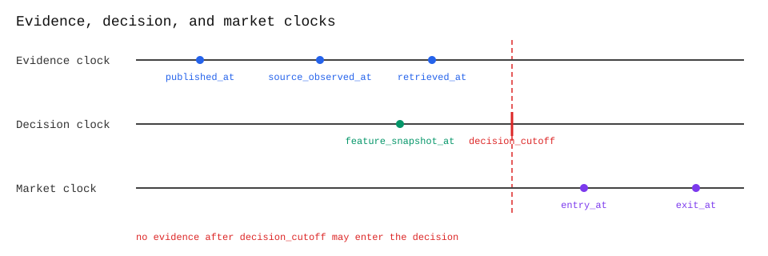
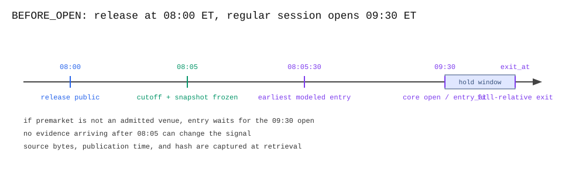
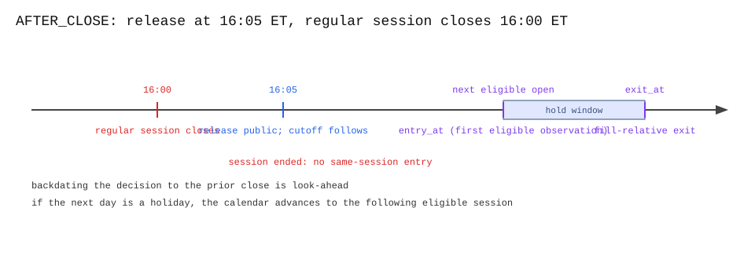
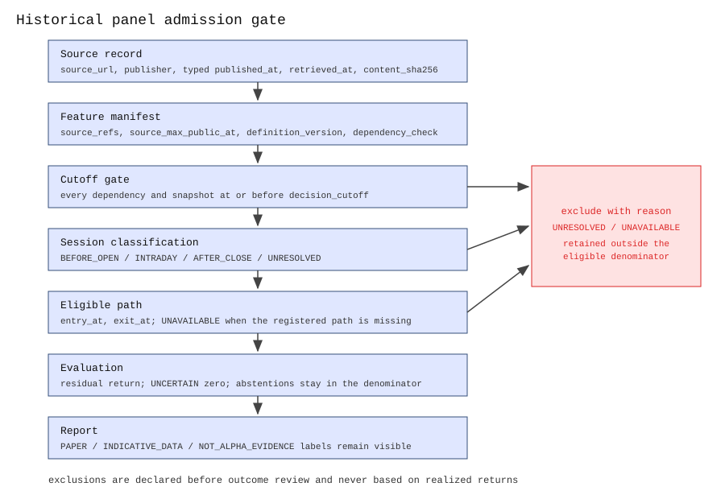

# Point-in-time evidence gate

Rules for evidence, timing, market data, and evaluation in a future historical event panel. The current repository remains documentation-only: it does not create a panel, tune a strategy, place an order, or claim alpha.

## 1. Scope and claim boundary

Esscher measures whether a signal describes an issuer's move after a scheduled earnings event and a fixed entry delay better than frozen comparators.

Use three separate clocks:

1. **Evidence clock:** when a source was publicly observable and when our process retrieved it.
2. **Decision clock:** the last instant at which the signal may use evidence.
3. **Market clock:** when a tradable market observation could actually provide an entry and a later exit.



Those clocks must not be collapsed into one timestamp. The current synthetic code enforces two aggregate boundaries: evidence and feature snapshots cannot be later than `decision_cutoff` (`src/ringdown_market/alpha/models.py`), and evaluation starts at the first path point at or after the modeled latency (`src/ringdown_market/alpha/evaluation.py`). The feature-level dependency gate for historical data is specified below but is not implemented by this slice.

The current synthetic fixture is not historical data. It carries `NOT_HISTORICAL_DATA`, `NOT_ALPHA_EVIDENCE`, and `NO_BROKER_EXECUTION`.

### Claim levels

Keep these claims separate:

| Level or qualifier | What it can support | What it cannot support |
| --- | --- | --- |
| Engineering evidence | Deterministic contracts, tests, hashes, and adapter behavior | Alpha, profitability, or real-world fill quality |
| Historical research evidence | Results from an untouched point-in-time panel that passes the registered gates | Executable option fills or live performance |
| Paper execution evidence | Sanitized readback from the dedicated Alpaca paper account | Historical executable pricing or profitability outside paper simulation |
| `INDICATIVE_DATA` qualifier | Research or demonstration observations | OPRA/NBBO, executable-fill, or option-P&L claims |

The permitted execution mode remains `PAPER`. This issue does not add broker code and does not change the repository's `NO_CREDENTIALS`, `NO_NETWORK_CALLS`, or `NO_ALPHA_CLAIM` offline boundaries.

## 2. Source hierarchy and provenance

Use the strongest source available, in this order:

1. official event rules and sponsor documentation;
2. the issuer's investor-relations release or earnings page, plus the issuer's SEC filing when relevant;
3. official SEC EDGAR records and official Alpaca documentation;
4. licensed market-data records with timestamps and entitlement notes;
5. reputable secondary reporting only when a primary source is unavailable.

Do not use a competitor submission, screenshot, dashboard, copied fixture, or an unsourced summary as evidence. Each event record must identify the source of each material fact. One event may use several sources. A weaker source cannot fill a missing timestamp or override a conflict without being recorded.

For an earnings event, use an issuer investor-relations release document that contains the release and a publisher-supplied timestamp. Use the related SEC filing to corroborate the disclosed content and retain its acceptance metadata separately. An issuer page that shows only a reporting date or conference-call time does not prove the release publication time.

### Required evidence record

Every evidence item must retain at least these fields:

| Field | Required meaning |
| --- | --- |
| `event_id` | Stable identifier that does not change when the record is re-downloaded. |
| `issuer` | Issuer name and, where applicable, ticker or CIK recorded separately. |
| `source_url` | Exact public URL used for the item. Keep the canonical URL and any accession/document identifier. |
| `publisher` | The organization that published the source, for example the issuer or SEC. |
| `published_at` | The earliest source-supported public-observability instant, normalized to UTC; `null` when the source supports only a date, interval, or unknown time. It is not retrieval time or SEC acceptance time. |
| `published_at_type` | The meaning of `published_at`, such as `issuer_release_timestamp`, `official_dissemination_timestamp`, `issuer_release_date`, or `unknown`. |
| `published_at_precision` | The precision actually supported by the source, such as `second`, `minute`, or `date`; never claim finer precision. |
| `published_date_or_interval` | The source's date or lower/upper time bounds when no exact `published_at` instant exists. Preserve the original precision and timezone. |
| `source_timezone` | The timezone printed or implied by the source before normalization to UTC. An unknown timezone remains unknown. |
| `accepted_at` | SEC `ACCEPTANCE-DATETIME`, normalized to UTC and retained separately from public-observability time. It is not a substitute for `published_at`. |
| `retrieved_at` | UTC time when our process fetched or observed the exact bytes. This is not a substitute for `published_at`. |
| `source_observed_at` | UTC time when our collector first saw the source. This is collector evidence, not the source's publication time. |
| `decision_cutoff` | UTC time after which no item may affect this decision. It is recorded per event, not inferred later from an outcome. |
| `feature_snapshot_at` | UTC time at which the input features were frozen. It must be at or before `decision_cutoff`. |
| `content_sha256` | SHA-256 of the exact byte representation frozen for the decision. Use raw source bytes by default; if a deterministic canonical representation is required, record that representation and its rules. |
| `hash_representation` | `raw_bytes` or the exact pre-registered canonicalization/version used before hashing. |
| `data_class` | Registered class of the artifact, such as `SYNTHETIC_CONTRACT_FIXTURE` or `POINT_IN_TIME_EVENT_PANEL`. Feed limitations are recorded separately as qualifiers. |
| `data_qualifiers` | Labels such as `INDICATIVE_DATA`, `PAPER`, or `NOT_ALPHA_EVIDENCE` that constrain what the artifact can support. |
| `entitlement_note` | Provider, plan/feed, access date, and any historical coverage or usage restriction for the observation. |
| `redistribution_note` | Whether the bytes may be redistributed, or whether only the URL, accession, metadata, and hash may be published. |
| `field_status` | Explicit `missing`, `revised`, or `conflicting` markers where the source does not provide one unambiguous value. |
| `field_source_refs` | Mapping from each material fact or feature input to the evidence-record IDs that support it. A bibliography alone is not this mapping. |
| `latest_evidence_at` | Derived maximum of the public-observability instants actually used by the decision; never compute it from acceptance, retrieval, or collector-observed times. |

Also retain the event category, venue/session calendar, session identifier, observation window, latency profile, target and actual entry latency, observation type, corporate-action treatment, and exclusion reason.

### Feature-level provenance is a separate requirement

`feature_snapshot_at` is the time a feature vector was computed or frozen. It does not prove that every input used to compute that vector was public by that time. The current `DecisionSnapshot` contains one aggregate `latest_evidence_at` and one aggregate `feature_snapshot_at`; the current CLI also accepts the numeric feature values directly. Neither boundary records the source dependency of each feature. A snapshot dated before the cutoff can therefore still contain a feature calculated from a later source unless a separate dependency check exists.

Before a historical row is admitted, retain a feature manifest with at least:

| Feature-manifest field | Required meaning |
| --- | --- |
| `feature_id` | Stable name and version of the derived feature. |
| `source_refs` | The evidence-record IDs used to compute the feature. |
| `source_max_public_at` | Latest public-observability time among all dependencies, or explicit `unknown`. |
| `feature_computed_at` | When the feature was computed and frozen. |
| `definition_version` | Version of the transformation, parser, and any beta/normalization inputs. |
| `field_status` | `present`, `missing`, `revised`, `conflicting`, or `unavailable`. |
| `dependency_check` | Result and version of the check that every source dependency was eligible at the cutoff. |

The admission test is dependency-closed: every source referenced by every feature must satisfy the cutoff, not merely the aggregate snapshot timestamp. The existing synthetic fields such as `opening_return` are valid only under the fixture's declared semantics. A historical manifest must define which session open and which observation type they refer to; it must not silently reuse an opening-return feature for an after-close or intraday event when the field's observation window is different.

`opening_return` is therefore a feature name, not a universal window definition. Before a panel is frozen, register `window_start_at`, `window_end_at`, `window_session_id`, and the source observation used at each endpoint. If that window includes the event reaction or a post-cutoff market observation, the field cannot be used as a decision feature for that event. The same rule applies to market and sector opening returns consumed by the frozen gap baselines.

### `published_at` is typed, not assumed

Store both the time and its meaning, for example:

```text
published_at: 2026-08-28T13:35:00Z
published_at_type: issuer_release_timestamp
published_at_precision: second
source_timezone: America/New_York
accepted_at: null
```

Useful timestamp types include:

- `issuer_release_timestamp`: timestamp printed by the issuer's release system or an issuer-hosted document;
- `official_dissemination_timestamp`: timestamp from an official public feed that establishes dissemination to the public;
- `issuer_release_date`: an issuer source supplies a date but no exact time;
- `unknown`: explicit failure state, never silently replaced by retrieval time.

The [SEC Developer FAQ](https://www.sec.gov/os/webmaster-faq#timestamps) states that EDGAR supplies acceptance and filing metadata, but no timestamp proving when filing content first became available on `sec.gov`. Therefore store an EDGAR `ACCEPTANCE-DATETIME` in `accepted_at`, not in `published_at`. `FILED AS OF DATE` is a date field, not an exact intraday observation time. A separate optional `source_observed_at` field may record when our collector first saw the source, but it must never be stored as the source's publication time.

If an issuer release or official dissemination record supplies a precise public time, use it for `published_at`. An SEC acceptance time, filed-as-of date, or collector retrieval alone is not enough to admit an event. Never use the midpoint of a date or an acceptance-to-web lag estimate as a publication time.

For sources that report only a date or a time interval, preserve the interval and its timezone, but do not admit the event to the historical panel. A second official source with an exact public timestamp may resolve the event. Never use a date midpoint, retrieval time, or an estimated acceptance-to-web delay.

### Source arbitration and statuses

Do not silently choose one timestamp when sources disagree. Apply this order:

1. Separate different timestamp types first. An issuer publication time and an SEC acceptance time are not conflicting values for the same field; retain the former as `published_at` and the latter as `accepted_at`.
2. Prefer the strongest source in the hierarchy that explicitly establishes public observability. Retain weaker corroborating sources and their hashes.
3. If official copies are clearly later mirrors of the same release, use the earliest exact timestamp that proves the original public release and retain every copy. If independent same-type sources claim different publication times and their ordering cannot be established, record every value, mark the timing `CONFLICTING`, set the event to `UNRESOLVED`, and exclude it.

`CONFLICTING` is an evidence status, not an event category. An event with conflicting timing is `UNRESOLVED` and excluded. `UNAVAILABLE` means the row passed the evidence/timing gate but lacks a complete common outcome path or other required evaluation input. It is excluded from the eligible-event denominator and reported with its exclusion reason. `UNCERTAIN` is a method decision: the event remains eligible, the method did not take a direction, and its signed return is zero.

### Retrieval and content hash rules

`retrieved_at` records when the exact source bytes entered our evidence store. It is useful for audit and for detecting later changes, but it does not make a later download available at an earlier decision. A late retrieval may be used only if an independently preserved historical version proves that the same content was available before the cutoff.

For `content_sha256`:

1. fetch the exact permitted representation;
2. preserve the raw bytes before parsing or whitespace normalization;
3. use the raw bytes by default, or apply a deterministic, pre-registered canonicalization rule when the decision requires one;
4. compute SHA-256 over the frozen representation;
5. parse a separate copy into features;
6. keep the URL, retrieval time, hash, representation rule, and parser/version metadata together.

SHA-256 is an integrity digest, not a publication timestamp or a signature. The [NIST Secure Hash Standard](https://csrc.nist.gov/pubs/fips/180-4/upd1/final) describes digests as a way to detect changes to messages. In this contract, the digest is useful only when the exact source representation and the digest are preserved together.

If a provider's terms prohibit storing or publishing the bytes, retain the permitted source reference and hash only if the terms allow hashing. This is an Esscher publication policy, not a determination that any particular provider permits redistribution or hashing. Use `PUBLIC_BYTES_ALLOWED`, `METADATA_AND_HASH_ONLY`, or `UNAVAILABLE_NOT_PERMITTED` as the explicit redistribution status. A hash proves that the stored representation matches the preserved digest; it does not prove the provider's publication time.

## 3. Event timing contract

All timestamps are stored in UTC with timezone information. Human-readable examples below use U.S. Eastern Time because the NYSE session calendar is defined in ET. The session calendar used in a real panel must be versioned and must account for holidays and early closes.

The [NYSE published schedule](https://www.nyse.com/markets/hours-calendars) identifies the core equity session as 9:30 a.m. to 4:00 p.m. ET, and shows different pre-opening, early, late, and options hours. The exact venue and instrument calendar must be used for the actual security; an equity session clock is not automatically an options fill clock.

### Event categories

Classify an earnings release by its verified public-observability time relative to the declared trading session for the evaluated instrument:

| Category | Definition | Earliest ordinary reaction window |
| --- | --- | --- |
| `BEFORE_OPEN` | Release is public before the declared session's opening auction or continuous session, and the session is eligible for the instrument. | The next eligible session, normally the same day. |
| `AFTER_CLOSE` | Release is public after the declared session's close, including an early close. | The next eligible trading session; never the already-ended session. |
| `INTRADAY` | Release is public after the declared session begins and before it closes. | A preregistered post-publication reaction window after processing latency. |
| `UNRESOLVED` | Timing or session status cannot be established safely. | No trade or historical admission until resolved. |

"Before" and "after" are not determined from the date alone. Use the source timezone, venue calendar, daylight-saving rules, holiday schedule, and any declared release-time convention.

Use the declared regular session only. Do not use extended-hours observations, opening or closing auction prints, or a different venue as a fallback. A source exactly at the session-open, session-close, auction, or early-close boundary is not rounded: use its precision and the venue calendar. If the precision cannot prove which side of the boundary applies, classify the event as `UNRESOLVED`.

For a timestamp precise enough to establish the ordering, use these half-open intervals for the declared session:

```text
BEFORE_OPEN: published_at < session_open_at
INTRADAY:    session_open_at <= published_at < session_close_at
AFTER_CLOSE: session_close_at <= published_at
```

The opening and closing auction are not eligible observations. Use the first eligible continuous-session observation after the registered delay. A release at exactly the opening boundary is `INTRADAY`, and one at exactly the closing boundary is `AFTER_CLOSE`, only when the source supports that exact ordering.

The event manifest must also record `session_id`, `session_open_at`, `session_close_at`, `entry_session_policy`, and `observation_type`. An auction print is not interchangeable with a continuous-session trade or quote. A halt, venue outage, or expiration that prevents the registered delayed-entry or fill-relative-exit window from being observed makes the outcome path `UNAVAILABLE`; it does not permit substituting a prior close, a later session, or a more convenient contract.

### Registered market convention

The historical panel uses the following fixed convention:

- Issuer, market, and sector returns use timestamped trade observations. If the source provides bars instead, the bar's close is usable only at its published end timestamp. Do not use a bar's open, high, or low as an earlier observation.
- Option observations use the Alpaca OPRA consolidated BBO. A long entry uses the ask and a long exit uses the bid; a short entry uses the bid and a short exit uses the ask. Require positive prices, positive displayed size, and a valid quote condition. A missing or invalid quote makes the path `UNAVAILABLE`.
- Quote midpoints are display values only. They are not used as option entry or exit prices and do not prove an execution.
- Candidate and baseline methods use the same venue, observation type, timestamp rule, adjustment rule, and session calendar.

The quote-based option prices estimate crossing the displayed BBO. They are not broker fill receipts.

### Before-open example

The following is an illustrative protocol, not a historical event. It uses a release at 08:00 ET, an evidence-processing allowance ending at 08:05 ET, a feature freeze at 08:05 ET, and a modeled 30-second delay. The entry observation is the first eligible path observation at or after 08:05:30 ET; if the strategy trades only the core session, the path may not admit an entry until the 09:30 ET open.



```text
BEFORE_OPEN (illustrative, regular session opens 09:30 ET)

08:00       08:05                 08:05:30                         09:30
  |-----------|---------------------|--------------------------------|
  release    cutoff + snapshot     earliest modeled entry            core open
  public     frozen                (first eligible path observation)  auction
  |
  +-- source bytes, publication time, and hash are captured
  +-- no evidence arriving after 08:05 can change the signal
  +-- if premarket is not an admitted venue, entry waits for 09:30

                         |<------ hold window ------>|
                         achieved entry              fill-relative exit
                         (entry_at)                  (exit_at)
```

The `decision_cutoff` is not necessarily the release time. It is the pre-registered end of processing and feature construction. The market path must still choose `entry_at` as the first eligible path observation, not a release-time price or an idealized zero-latency fill. In the current synthetic harness, this is deterministic path selection only: `PricePoint` has no bid, ask, trade/quote type, venue, size, condition, auction, or liquidity fields. It must therefore be called an eligible observation, not a demonstrated tradable or executable fill. A future historical panel needs those fields and a registered quote-versus-trade rule before using stronger execution language.

### After-close example

This is also illustrative. A release at 16:05 ET follows a 16:00 ET close. A same-day decision is impossible for the regular session because that session has ended. A policy may process the release after 16:05, but the earliest ordinary entry is in the next eligible session. If the next day is a holiday, the calendar advances to the following eligible session.



```text
AFTER_CLOSE (illustrative, regular session closes 16:00 ET)

prior session ends       release                 next eligible session
       16:00              16:05                         open
         |                  |                            |
---------+------------------+----------------------------+---------------->
         |                  |                            |
         |                  +-- process and freeze       +-- entry_at
         |                      features                   first eligible
         |                      (decision_cutoff)           observation after
         |                                                   cutoff + latency
         |                                                        |
         |                                                   +----+----+
         |                                                   | hold   |
         |                                                   |window  |
         |                                                   +----+----+
         |                                                        |
         |                                                        +-- exit_at
         |                                                            first eligible
         |                                                            observation after hold
```

The after-close event belongs to the next eligible reaction window. Backdating the decision to the prior close, or using the next morning's information in a prior-session return, is look-ahead.

### Intraday policy

For an intraday release, retain the source's exact timestamp if available. Set the processing cutoff to a declared point after that timestamp, for example:

```text
event_public_at <= processing_complete_at = decision_cutoff
feature_snapshot_at <= decision_cutoff
entry_at >= decision_cutoff + modeled_latency
exit_at >= entry_at + hold_period
```

The reaction window must be registered before outcomes are inspected. It must state whether the opening or last price of a bar is usable, which quote/trade observation is eligible, how missing bars are handled, and what happens if the market closes before the hold completes. If the required path is missing, mark the row unavailable or exclude it under a predeclared rule; do not substitute a future observation and do not select a more convenient event.

## 4. What each decision timestamp means

These fields are related but not interchangeable:

| Timestamp | Meaning | Can it move because of an outcome? |
| --- | --- | --- |
| `published_at` | Earliest source-supported public-observability time, or `null` when no instant is supported. | No. It is a source fact or an explicit unknown. |
| `published_at_type` | Meaning of `published_at`, including its precision. | No. It is never silently inferred. |
| `accepted_at` | SEC acceptance time, when applicable; it does not prove first availability on `sec.gov`. | No. It is retained separately. |
| `retrieved_at` | When our process captured the source representation. | No. It is recorded at collection time. |
| `source_observed_at` | When our collector first saw the representation. | No. It is collector evidence only. |
| `decision_cutoff` | Last instant at which evidence/features may enter the decision. | No. It is registered before evaluation. |
| `feature_snapshot_at` | When the feature vector was frozen. | No. It must be at or before the cutoff. |
| `entry_at` | First eligible market observation at or after cutoff plus modeled delay. | No. It is selected by the preregistered path rule. |
| `exit_at` | First eligible observation at or after entry plus the hold period. | No. It is fill-relative, not cutoff-relative. |

The current `DecisionSnapshot` rejects a later `latest_evidence_at` or `feature_snapshot_at`. It does not carry a source dependency graph for each feature, so those checks are aggregate snapshot checks, not proof of feature-level point-in-time correctness. The current evaluator computes the target entry from `decision_cutoff + latency`, chooses the first available path point, and computes the exit from that achieved entry. A future panel loader must preserve these semantics and add the feature manifest above rather than replacing them with a single event date.

### Missing, revised, and conflicting evidence

- **Missing time:** set `published_at_type: unknown`, record the missing field, and exclude the event. Do not infer "before open" from a date-only page.
- **Revised source:** retain the original captured hash and the later revision as separate evidence versions. The decision can use only the version known to be available by its cutoff.
- **Conflicting times:** keep both sources and their hashes, mark the timing evidence `CONFLICTING`, set the event to `UNRESOLVED`, and exclude it.
- **Late SEC availability ambiguity:** distinguish EDGAR acceptance from first availability on `sec.gov`; if the latter is not established, do not claim an exact public-observation time.

## 5. Residual return

The raw issuer move contains more than an issuer-specific reaction. It can include a broad market move and a sector move during the same entry-to-exit window. Event-study methodology examines security-price effects around an event and commonly compares the issuer's move with reference-market behavior; see MacKinlay's [event-study survey](https://ideas.repec.org/a/aea/jeclit/v35y1997i1p13-39.html). Esscher removes its registered market and sector components with frozen betas.

For event `i`, define log returns over the **same achieved window** from `entry_at` to `exit_at`:

```text
r_stock  = log(stock_exit  / stock_entry)
r_market = log(market_exit / market_entry)
r_sector = log(sector_exit / sector_entry)

residual_return = r_stock - beta_market * r_market - beta_sector * r_sector
signed_return   = direction.multiplier * residual_return
```

This is the same structure implemented in `src/ringdown_market/alpha/evaluation.py`. A positive residual means the issuer outperformed the frozen market/sector expectation over that window; a negative residual means it underperformed. It does not prove that the signal caused the move.

### Residualization rules

1. Register the market and sector proxy before looking at the event outcome.
2. Estimate or freeze `beta_market` and `beta_sector` using only data available at the feature cutoff. Do not estimate them from the post-event reaction window.
3. Use synchronized, timezone-aware observations for issuer, market, and sector.
4. Use the same eligible path observation and fill-relative exit window for all three series.
5. Record missing observations, corporate-action treatment, proxy identity, estimation window, and beta version.
6. If the market or sector series cannot be aligned without look-ahead, fail closed rather than silently falling back to an unrelated window.

Residualization is an evaluation choice, not a guarantee that all confounding has been removed. MacKinlay's [academic event-study survey](https://ideas.repec.org/a/aea/jeclit/v35y1997i1p13-39.html) describes event studies as measuring price effects around an event and discusses their complications; it does not validate this repository's exact beta model. Esscher's chosen formula and window must therefore remain explicit and preregistered.

## 6. Abstention and denominators

`UNCERTAIN` is a real method decision, not a deleted row. In the current evaluator, it is not admitted and its signed return is `0.0`. In the current Q-FAST panel metrics, every eligible row contributes to `eligible_events` and `mean_all`, while only admitted rows contribute to `mean_admitted`.

Define the event universe before inspecting realized returns:

| Status | Meaning | Eligible denominator? |
| --- | --- | --- |
| `ELIGIBLE` | Evidence, timing, feature dependencies, and the common outcome path pass the registered gate. | Yes. |
| `UNCERTAIN` | A method abstains on an eligible event. | Yes; signed return is zero for that method. |
| `UNAVAILABLE` | The event passed evidence/timing review but a required outcome observation, synchronized proxy, or registered input is unavailable. | No; retain the row and exclusion reason outside the denominator. |
| `UNRESOLVED` | Publication timing, source conflict, or session status is not established. | No; do not make it eligible. |

`UNAVAILABLE` must be determined from data availability and the preregistered path rule, never from whether the realized return is attractive. If one method cannot evaluate a path that is required for every method, exclude the event from the common panel for all methods rather than comparing different event subsets. If only a method-specific signal is missing while the common outcome exists, record a method-level `UNCERTAIN` or other predeclared method status; do not silently drop the event.

For method `m` with `N` eligible events:

```text
coverage_m       = admitted_events_m / N
mean_all_m       = sum(signed_return_i,m for all eligible i) / N
mean_admitted_m  = mean(signed_return_i,m for admitted i), if any
```

Keep both views. `mean_admitted` describes outcomes conditional on taking a signal. `mean_all` describes the registered strategy across the eligible event universe, where abstention carries no return. Reporting only admitted events can make a strategy look better by hiding difficult cases and can make comparisons unfair if methods admit different rows.

The denominator is frozen before outcomes are reviewed. Do not remove an abstention because its eventual move would have been favorable or unfavorable. Do not compare a candidate on one event subset with a baseline on another. Candidate and frozen baselines must use the same eligible panel, timing rules, latency profile, risk convention, and hold window.

In this offline harness, "equal risk" means a common unit of signed residual log-return under the same event path, beta convention, and evaluation window. It does not mean equal capital, volatility, option exposure, spread cost, or live portfolio risk: the current evaluator has no sizing, transaction-cost, spread, slippage, contract-multiplier, or risk-normalization model. A future comparison that claims equal risk must register those assumptions and apply them to the candidate and every frozen baseline identically.

## 7. Data access, redistribution, and options limits

### Public event evidence

The [SEC EDGAR API documentation](https://www.sec.gov/search-filings/edgar-application-programming-interfaces) states that `data.sec.gov` submissions and XBRL APIs require no authentication and are updated as filings are disseminated. The [SEC Developer FAQ](https://www.sec.gov/os/webmaster-faq#reuse) also says public EDGAR content is free to access and reuse. This supports public source references and, where permitted, sanitized extracts. We still need to preserve the exact source URL, timestamp type, retrieval time, and hash for replay.

Issuer investor-relations releases are primary event sources when they provide the release itself and its publication time. Their website terms and document delivery behavior may differ. If the raw release cannot be redistributed, publish only the permitted metadata, a canonical URL/accession, and an allowed hash.

### Market data

Any market-data record used for a historical panel needs an entitlement note, timestamp precision, exchange/venue semantics, corporate-action policy, and redistribution permission. A public API endpoint does not by itself grant a right to publish the raw dataset.

For each issuer, market, sector, and option observation, retain the instrument identifier, venue/feed, observation type (`quote`, `trade`, `bar`, or `auction`), source timestamp, normalized UTC timestamp, price fields, size when supplied, condition when supplied, adjustment status, and source record ID. A bar must also state whether its open, close, high, low, or midpoint is used. Missing size or condition is not evidence of liquidity; unknown fields stay unknown. The common path rule must be registered before outcome review and must choose the same observation type and adjustment convention for candidate and baselines.

### Alpaca options data

The [Alpaca historical option-data documentation](https://docs.alpaca.markets/us/docs/historical-option-data) says historical options are available from February 2024 onward and distinguishes:

- `Indicative`: a free derivative of OPRA; its quotes are not actual OPRA quotes, and trades are delayed by 15 minutes;
- `OPRA`: consolidated BBO data available to subscribed users.

Alpaca's [market-data documentation](https://docs.alpaca.markets/us/docs/about-market-data-api) further describes Basic-plan options as indicative and the subscribed complete feed as OPRA. It also documents a Basic-plan historical-data limitation of the latest 15 minutes for options, while Algo Trader Plus has no such limitation. Therefore a historical panel built from free indicative data must be labeled `INDICATIVE_DATA` and may be impossible to construct retrospectively from the Basic plan alone. It cannot support claims about an executable option fill, NBBO, spread capture, slippage, or option P&L.

`POINT_IN_TIME_EVENT_PANEL` remains the artifact class for a historical event panel. `INDICATIVE_DATA` is a feed/data-quality qualifier attached to the relevant source or panel, not a replacement fixture class in the current CLI. The qualifier must flow into the report and public trace, and it constrains the claims regardless of whether the panel also contains equity or issuer data.

The [option stream documentation](https://docs.alpaca.markets/us/docs/real-time-option-data) gives quote/trade timestamps and venue fields, but a timestamped quote is still not a broker fill. To claim a paper execution, use sanitized paper-account order and fill readback under the repository's one official adapter. Do not use the paper result as historical option-price evidence.

### Paper simulation limits

The [Alpaca paper-trading documentation](https://docs.alpaca.markets/us/docs/paper-trading) describes paper trading as a real-time simulation, not live exchange routing. It lists limitations including no market impact, information leakage, latency slippage, queue position, price improvement, regulatory fees, or dividends. It also states that paper orders are matched against the best available current market price and that quantity is not checked against NBBO quantity.

These limitations mean:

- a paper fill can show that our adapter and reconciliation path behaved in a simulated account;
- a paper fill cannot prove that an historical option quote was executable;
- paper P&L cannot establish profitability in live markets;
- a free indicative option quote cannot be relabeled as OPRA or NBBO.

The document and any future public trace must retain `PAPER`, `INDICATIVE_DATA`, and `NOT_ALPHA_EVIDENCE` where applicable.

## 8. Historical-panel admission gate



Before a row enters a `POINT_IN_TIME_EVENT_PANEL`, check all of the following:

1. The event has a stable ID, issuer, category, session calendar, and source hierarchy record.
2. Every feature source has `source_url`, `publisher`, `published_at`, `retrieved_at`, `decision_cutoff`, `feature_snapshot_at`, and `content_sha256` semantics.
3. Every timestamp has a timezone and typed meaning. Unknown or conflicting timing is explicitly marked.
4. No source or feature used by the decision is later than `decision_cutoff`.
5. `feature_snapshot_at <= decision_cutoff`.
6. The event category and next eligible session are determined without using the realized return.
7. The market, sector, and issuer paths are synchronized and cover the eligible delayed-entry and fill-relative exit windows.
8. The latency profile and reaction/hold window were registered before outcomes were inspected.
9. Abstentions remain in the panel denominator.
10. Data class, entitlement, redistribution, and any `INDICATIVE_DATA` limits are recorded.
11. Exclusions are declared before outcome review and carry a reason.
12. No selection is based on realized return, favorable fills, or a desired sample size.

The repository's source policy additionally requires at least 20 untouched eligible events for a Q-FAST panel. Fewer rows may exercise code contracts but must remain insufficient research evidence. A passing or non-rejected Q-FAST screen retains `NOT_ALPHA_EVIDENCE` under the current implementation.

## 9. Verified facts, implementation choices, unresolved questions

### Verified facts

Current implementation:

- `DecisionSnapshot` rejects aggregate `latest_evidence_at` or `feature_snapshot_at` after `decision_cutoff` (`src/ringdown_market/alpha/models.py`). It does not check each feature's source dependencies; the feature-level dependency gate is specified in this note but not implemented.
- The evaluator selects the first synthetic path point at or after cutoff plus modeled latency and measures the exit from that entry (`src/ringdown_market/alpha/evaluation.py`). This is path selection, not proof of an executable fill.
- The evaluator removes market and sector returns over the same entry-to-exit window and maps `UNCERTAIN` to zero signed return while retaining the event (`src/ringdown_market/alpha/evaluation.py`).
- Q-FAST retains eligible events in the denominator and reports admitted-only metrics separately (`src/ringdown_market/alpha/qfast.py`).
- The synthetic `PricePoint` path has no bid, ask, trade/quote type, venue, size, condition, auction, or liquidity fields, so synthetic entries are eligible observations, not demonstrated fills.

External sources:

- SEC's EDGAR API page says `data.sec.gov` APIs require no authentication or API keys and are updated as submissions are disseminated.
- SEC's Developer FAQ distinguishes acceptance, filed-as-of, and change dates and says there is no timestamp proving when content first became available on `sec.gov`.
- NYSE publishes core equity hours of 09:30 to 16:00 ET, separate options hours, and holiday and early-close calendars.
- Alpaca documents historical options from February 2024 onward, separates indicative data from subscribed OPRA data, and limits Basic-plan options history to the latest 15 minutes.
- Alpaca documents paper trading as a real-time simulation with material fill and P&L limitations.
- NIST describes SHA-256 as a message-digest integrity mechanism; a digest does not establish publication time.
- MacKinlay's event-study survey is methodological background for comparing an issuer's move with reference-market behavior, not primary timestamp evidence.

### Implementation choices

- Store machine timestamps in UTC and retain the source timezone, type, and precision for every publication claim.
- Store SEC acceptance in `accepted_at`, never as `published_at`.
- Exclude events whose only timing evidence is a date, an acceptance time, or a retrieval time.
- Exclude events with conflicting same-type publication timestamps; retain every source and hash.
- Classify events against a versioned regular-session calendar and use regular-session observations only.
- Use timestamped trades for issuer, market, and sector returns; use a bar close only at its end timestamp; use split-adjusted price-only equity series and record the adjustment method.
- Use OPRA BBO quotes for options: buys cross the ask, sells cross the bid; require positive prices, positive displayed size, and a valid condition.
- Freeze features and every source dependency at or before `decision_cutoff`; choose entry and exit from the same eligible synchronized path for candidate and baselines.
- Freeze residualization betas before outcome review; keep abstentions in the eligible denominator.
- Use Alpaca Algo Trader Plus with the OPRA feed for historical option observations; label indicative data `INDICATIVE_DATA` and never use it for OPRA, NBBO, fill, spread, slippage, or option-P&L claims.
- Submit flat: cancel open orders and close positions before submission; require no minimum live-trade count; require at least 20 untouched eligible events for Q-FAST.
- Publish source references, metadata, and hashes; publish raw bytes only where the source terms permit.
- Implement the feature-level dependency gate before admitting any historical row; until then the repository remains synthetic-only.

### Unresolved questions

These items are not closed by this repository. Each has a local rule that fails closed while open, and a closure step that must happen before the corresponding data collection or submission.

| Question | Local rule while open | Closure step |
| --- | --- | --- |
| Does the organizer require flat positions or a minimum trade count at submission? | Submit flat and require no minimum live trades; keep the 20-event research floor. | Recheck the official event page and organizer updates immediately before submission. |
| Which option entitlement and redistribution rights apply to the historical panel? | Use Algo Trader Plus with OPRA; publish raw option bytes only when the terms explicitly allow it. | Record the selected plan/feed and current provider terms before collecting data. |
| Which issuer channel is authoritative when official copies disagree? | Use the earliest exact timestamp that proves the original public release when copies are mirrors; exclude truly conflicting independent timestamps. | Retain every copy and hash; resolve only with additional official evidence. |
| What may be done with date-only or SEC-only timing? | Exclude the event unless another official source supplies an exact public timestamp. | Obtain an official exact timestamp or keep the event out of the panel. |
| Which venue/session calendar and quote-versus-trade convention applies per instrument? | Use the registered regular-session convention in this document. | Freeze the per-instrument calendar, feed, observation type, and adjustment rule before the panel. |
| What path coverage is required across holidays, early closes, halts, or option expiration? | Mark the outcome `UNAVAILABLE` and exclude; never substitute another session, venue, or contract. | Register the coverage rule before outcome review and apply it unchanged. |
| Is the feature-level dependency gate implemented? | No. Historical rows are not admitted until it exists. | Implement and test the manifest check before building a `POINT_IN_TIME_EVENT_PANEL`. |

## 10. Understanding Gate: Simple Answers

### 1. Why is evidence published after `decision_cutoff` forbidden?

Because the agent could not have known it at the time it made the decision. If we use it anyway, the test sees the future and the result is too good to trust.

### 2. Why does an abstention stay in the denominator?

It is a part of the strategy. Keeping that event in the total shows how often the strategy acted and prevents us from hiding hard events. The abstention gets zero return, while the coverage number says how many events received a direction.

### 3. What does residual return remove?

It removes the part of the issuer's move that can be explained by the broad market and the issuer's sector over the same time window. What remains is the issuer move after those reference moves are taken out. It is not proof that the signal caused the move.

### 4. Why can a deterministic synthetic test not prove alpha?

The test uses made-up, fixed inputs designed to check software rules. It proves that the program gives the same expected answer and rejects bad timestamps. It does not prove the inputs happened in real markets, that prices were tradable, or that the strategy makes money.

### 5. Why is a source URL alone insufficient without publication and retrieval timestamps?

Because a URL does not tell us which version was visible or when we obtained it. A page can change later, and downloading it later does not mean its current contents were available earlier. Publication time tells us what could have been known; retrieval time tells us when we captured the version we used.

## Sources

The links below support the external facts in this document. Access dates show when each source was checked.

### Official event and repository sources

1. [Issue #1: Lane B point-in-time evidence gate](https://github.com/Tempest-Research/ringdown-market/issues/1) - repository issue and acceptance criteria; checked 2026-08-29.
2. [Esscher source and claim policy](../SOURCE_AND_CLAIM_POLICY.md) - repository policy; checked 2026-08-29.
3. [Esscher architecture](../ARCHITECTURE.md) - implemented evaluation boundaries; checked 2026-08-29.
4. [Esscher team onboarding](../TEAM_ONBOARDING.md) - current research and claim boundaries; checked 2026-08-29.
5. [Alpaca AI Trading Agents Hackathon](https://lablab.ai/ai-hackathons/alpaca-ai-trading-agents-hackathon) - event dates, submission information, Alpaca paper-account requirements, and judging criteria; checked 2026-08-29.

### SEC and EDGAR

6. [SEC EDGAR Application Programming Interfaces](https://www.sec.gov/search-filings/edgar-application-programming-interfaces) - public API access, update behavior, and no API-key requirement for `data.sec.gov`; checked 2026-08-29.
7. [SEC Webmaster FAQ](https://www.sec.gov/os/webmaster-faq#developers) - request limits, user-agent guidance, EDGAR timestamp meanings, and lack of a first-availability timestamp; checked 2026-08-29.
8. [SEC Search Filings](https://www.sec.gov/edgar/search-and-access) - public EDGAR filing access and search entry points; checked 2026-08-29.

### Market sessions

9. [NYSE Holidays and Trading Hours](https://www.nyse.com/markets/hours-calendars) - equity, options, holiday, and early-close session schedule; checked 2026-08-29.

### Alpaca

10. [Alpaca Historical Option Data](https://docs.alpaca.markets/us/docs/historical-option-data) - availability from February 2024 and `Indicative` versus `OPRA` data sources; checked 2026-08-29.
11. [Alpaca About Market Data API](https://docs.alpaca.markets/us/docs/about-market-data-api) - Trading API authentication, plan entitlements, and Basic-plan historical options limitation; checked 2026-08-29.
12. [Alpaca Paper Trading](https://docs.alpaca.markets/us/docs/paper-trading) - simulation model, paper/live differences, fill assumptions, and limitations; checked 2026-08-29.
13. [Alpaca Options Trading](https://docs.alpaca.markets/us/docs/options-trading) - paper options enablement, contract details, order constraints, and paper non-trade activity timing; checked 2026-08-29.
14. [Alpaca Real-time Option Data](https://docs.alpaca.markets/us/docs/real-time-option-data) - option quote/trade timestamp fields and feed-specific stream behavior; checked 2026-08-29.
15. [NIST Secure Hash Standard](https://csrc.nist.gov/pubs/fips/180-4/upd1/final) - message-digest integrity purpose; checked 2026-08-29.

### Academic method

16. A. Craig MacKinlay, [Event Studies in Economics and Finance](https://ideas.repec.org/a/aea/jeclit/v35y1997i1p13-39.html), *Journal of Economic Literature*, 35(1), 13-39, 1997 - event-study methodology and complications; abstract and citation checked 2026-08-29.

## Before using a historical panel

- Verify each external fact against its linked source.
- Record source bytes, hashes, timestamps, and entitlement notes in a permitted evidence store.
- Keep public artifacts static, sanitized, and free of credentials, account IDs, private documents, raw databases, and network capability.
- Confirm that every row passes the admission gate before calculating outcomes.
